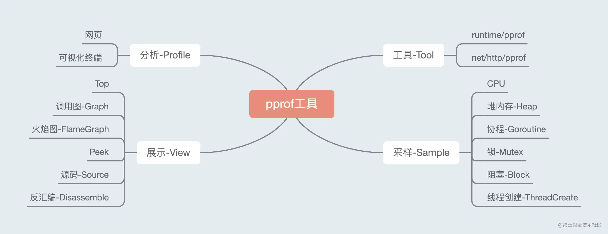

```json
{
  "date":"2023.01.18 15:00",
  "author":"XinceChan",
  "tags":["Golang","性能优化"],
  "musicId":"64106"
}
```

本节主要简要介绍了高质量编程的定义和原则，分享了代码格式、注释、命名规范、控制流程、错误和异常处理五方面的常见编码规范。目标主要达成以下四点：如何编写更简洁清晰的代码；常用Go语言程序优化手段；熟悉Go程序性能分析工具；了解工程中性能优化的原则和流程。

## 性能调优工具

> 性能调优原则

- 要依靠数据而不是猜测
- 要定位最大瓶颈而不是细枝末节
- 不要过早优化
- 不要过度优化

### 性能分析工具 pprof

- 希望知道应用在什么地方耗费了多少CPU、Memory
- pprof是用于可视化和分析性能分析数据的工具



http://localhost:6060/debug/pprof/

```go
go tool pprof "http://localhost:6060/debug/pprof/profile?seconds=10"
```

- flat：当前函数本身的执行耗时
- flat%：flat占CPU总时间的比例
- sum%：上面每一行的flat%总和
- cum：指当前函数本身加上其调用函数的总耗时
- cum%：cum占CPU总时间的比例

```go
(pprof) top
Showing nodes accounting for 3320ms, 100% of 3320ms total
      flat  flat%   sum%        cum   cum%
    3190ms 96.08% 96.08%     3320ms   100%  github.com/wolfogre/go-pprof-practice/animal/felidae/tiger.(*Tiger).Eat
     130ms  3.92%   100%      130ms  3.92%  runtime.asyncPreempt
         0     0%   100%     3320ms   100%  github.com/wolfogre/go-pprof-practice/animal/felidae/tiger.(*Tiger).Live
         0     0%   100%     3320ms   100%  main.main
         0     0%   100%     3320ms   100%  runtime.main
```

#### 排查 CPU 问题

- 命令行分析

  - ```go
    go tool pprof "http://localhost:6060/debug/pprof/profile?seconds=10"
    ```

- top 命令

- list 命令

- 熟悉 web 页面分析

- 调用关系图，火焰图

- ```go
  go tool pprof -http=:8080 "http://localhost:6060/debug/pprof/cpu"
  ```

#### 排查堆内存问题

- ```go
  go tool pprof -http=:8080 "http://localhost:6060/debug/pprof/heap]"
  ```

#### 排查协程问题

- ```go
  go tool pprof -http=:8080 "http://localhost:6060/debug/pprof/goroutine"
  ```

#### 排查锁问题

- ```go
  go tool pprof -http=:8080 "http://localhost:6060/debug/pprof/mutex"
  ```

#### 排查阻塞问题

- ```go
  go tool pprof -http=:8080 "http://localhost:6060/debug/pprof/block"
  ```
