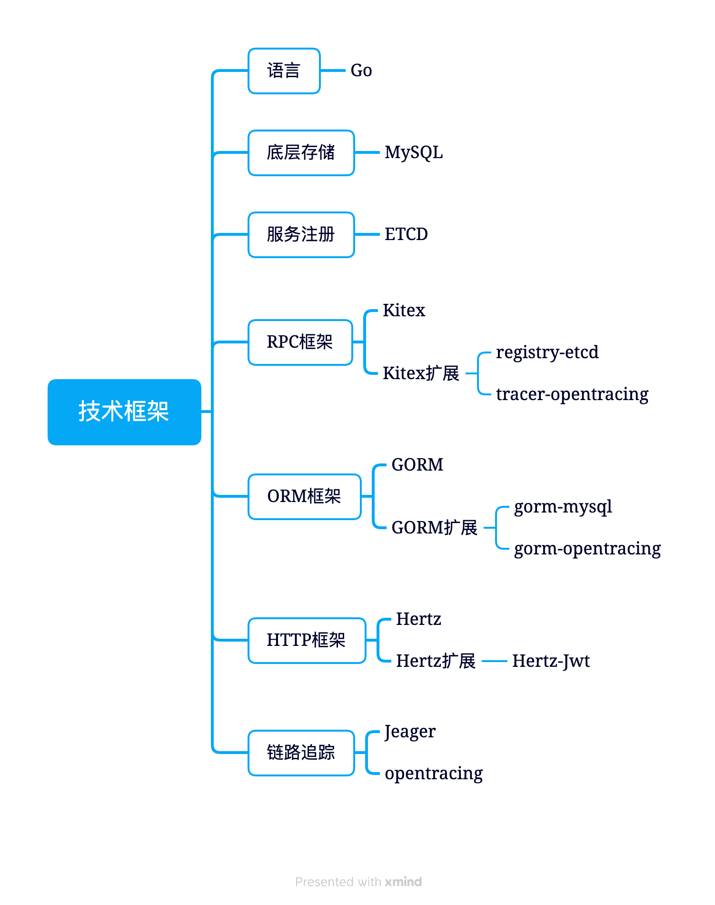

```json
{
    "date":"2023.01.20 17:00",
    "author":"XinceChan",
    "tags":["Golang","Go框架"],
    "musicId":"2004562490"
}
```

## 三件套的使用

### Gorm的基础使用

- Gorm 使用名为 ID 的字段作为主键
- 使用结构体的蛇形复数作为表明
- 字段名的蛇形作为列名
- 使用 CreatedAt、 UpdatedAt 字段作为创建、更新时间

```go
// 定义gorm model
type Product struct {
    Code string
    Price uint
}
// 为model定义表名
func (p *Product) TableName() string {
    return "product"
}
func main() {
    db, err := gorm.Open(mysql.Open("user:pass@tcp(127.0.0.1:3306)/dbname?charset=utf8mb4&parseTime=True&loc=Local"), &gorm.Config{}) // 连接数据库
    if err != nil {
        panic("failed to connect database")
    }
    // Create
    db.Create(&Product{Code: "D42", Price: 100})
    // Read
    var product Product
    db.First(&product, 1) // 根据整形主键查找
    db.First(&product, "code = ?", "D42") // 查找 code 字段值为 D42 的记录
    // Update - 将 product 的 price 更新为 200
    db.Model(&product).Update(Product{Price: 200, Code: "F42"}) // 仅更新非零值字段
    db.Model(&product).Updates(map[string]interface{}{"Price": 200, "Code": "F42"})
    // Delete - 删除 product
    db.Delete(&product, 1)
}
```

### Gorm支持的数据库

GORM 官方支持的数据库类型有： MySQL, PostgreSQL, SQlite, SQL Server

```go
import (
    "gorm.io/driver/mysql"
    "gorm.io/gorm"
)

func main() {
    // 参考 https://github.com/go-sql-driver/mysql#dsn-data-source-name 获取详情
    dsn := "user:pass@tcp(127.0.0.1:3306)/dbname?charset=utf8mb4&parseTime=True&loc=Local"
    db, err := gorm.Open(mysql.Open(dsn), &gorm.Config{})
}
```

### Gorm创建数据

```go
package main

import (
	"fmt"

	"gorm.io/driver/mysql"
	"gorm.io/gorm"
)

type Product struct {
	ID    uint   `gorm:"primarykey"`
	Code  string `gorm:"column: code"`
	Price uint   `gorm:"column: user_id"`
}

func main() {
    db, err := gorm.Open(mysql.Open("user:pass@tcp(127.0.0.1:3306)/dbname?charset=utf8mb4&parseTime=True&loc=Local"), &gorm.Config{}) // 连接数据库
	if err != nil {
		panic("failed to connect database")
	}
	db.AutoMigrate(&Product{})
	// 创建一条
	p := &Product{Code: "D42"}
	res := db.Create(p)
	fmt.Println(res.Error) // 获取err
	fmt.Println(p.ID)      // 返回插入数据的主键
	// 创建多条
	products := []*Product{{Code: "D42"}, {Code: "D43"}}
	res = db.Create(products)
	fmt.Println(res.Error) // 获取err
	for _, p := range products {
		fmt.Println(p.ID)
	}
}
```

#### 如何使用默认值

您可以通过标签 `default` 为字段定义默认值，如：

>```go
>type User struct {
>  	ID         int64
>  	Name       string `gorm:"default:galeone"`
>  	Age        int64  `gorm:"default:18"`
>  	uuid.UUID  UUID   `gorm:"type:uuid;default:gen_random_uuid()"` // 数据库函数
>}
>```

**注意** `0`、`''`、`false` 之类零值，这些字段定义的默认值不会被保存到数据库，您需要使用指针类型或 Scanner/Valuer 来避免这个问题，例如：

> ```go
> type User struct {
>   	gorm.Model
>   	Name string
>   	Age  *int           `gorm:"default:18"`
>   	Active sql.NullBool `gorm:"default:true"`
> }
> ```

**注意** 对于在数据库中有默认值的字段，你必须为其 struct 设置 `default` 标签，否则 GORM 将在创建时使用该字段的零值，例如：

>```go
>type User struct {
>    ID   string `gorm:"default:uuid_generate_v3()"`
>    Name string
>    Age  uint8
>}
>```

#### 如何使用upsert

GORM 为不同数据库提供了兼容的 Upsert 支持

```go
import "gorm.io/gorm/clause"

// 不处理冲突
DB.Clauses(clause.OnConflict{DoNothing: true}).Create(&user)

// `id` 冲突时，将字段值更新为默认值
DB.Clauses(clause.OnConflict{
  Columns:   []clause.Column{{Name: "id"}},
  DoUpdates: clause.Assignments(map[string]interface{}{"role": "user"}),
}).Create(&users)
// MERGE INTO "users" USING *** WHEN NOT MATCHED THEN INSERT *** WHEN MATCHED THEN UPDATE SET ***; SQL Server
// INSERT INTO `users` *** ON DUPLICATE KEY UPDATE ***; MySQL
```

### Gorm查询数据

```go
func main() {
	db, err := gorm.Open(mysql.Open("root:1838830210@tcp(127.0.0.1:3306)/gorm?charset=utf8mb4&parseTime=True&loc=Local"), &gorm.Config{}) // 连接数据库
	if err != nil {
		panic("failed to connect database")
	}
	db.AutoMigrate(&User{})
	// 获取第一条记录（主键升序），查询不到数据则返回 ErrRecordNotFound
	u := &User{}
	db.First(u) // SELECT * FROM users ORDER BY id LIMIT 1;
	// 查询多条数据
	users := make([]*User, 0)
	result := db.Where("age > 10").Find(&users) // SELECT * FROM users where age > 10;
	fmt.Println(result.RowsAffected)            // 返回找到的记录数，相当于 `len(users)`
	fmt.Println(result.Error)                   // returns error
	// IN SELECT * FROM users WHERE name IN ('jinzhu', 'jinzhu 2');
	db.Where("name IN ?", []string{"jinzhu", "jinzhu 2"}).Find(&users)
	// LIKE SELECT * FROM users WHERE name LIKE '%jin%';
	db.Where("name LIKE ?", "%jin%").Find(&users)
	// AND SELECT * FROM users WHERE name = 'jinzhu' AND age >= 22;
	db.Where("name = ? AND age >= ?", "jinzhu", "22").Find(&users)

	// SELECT * FROM users WHERE name = "jinzhu";
	db.Where(&User{Name: "jinzhu", Age: 0}).Find(&users)
	// SELECT * FROM users WHERE name = "jinzhu" AND age = 0;
	db.Where(map[string]interface{}{"Name": "jinzhu", "Age": 0}).Find(&users)
}
```

#### First 的使用踩坑

使用 `First` 时，需要注意查询不到数据会返回 `ErrRecordNotFound`。

使用 `Find` 查询多条数据，查询不到数据不会返回错误。

#### 使用结构体作为查询条件

当使用结构作为条件查询时，Gorm 只会查询非零值条件。这意味着如果您的字段值为 `0`、`''`、`false` 之类零值，该字段不会被用于构建查询条件，使用 `Map`来构建查询条件。

#### 选择特定的字段

> ```go
> 选择您想从数据库中检索的字段，默认情况下会选择全部字段
> 
> db.Select("name", "age").Find(&users)
> // SELECT name, age FROM users;
> 
> db.Select([]string{"name", "age"}).Find(&users)
> // SELECT name, age FROM users;
> 
> db.Table("users").Select("COALESCE(age,?)", 42).Rows()
> // SELECT COALESCE(age,'42') FROM users;
> ```

#### 智能选择字段

GORM 允许通过 [`Select`](https://gorm.cn/zh_CN/docs/query.html) 方法选择特定的字段，如果您在应用程序中经常使用此功能，你也可以定义一个较小的结构体，以实现调用 API 时自动选择特定的字段，例如：

> ```go
> type User struct {
>   	ID     uint
>   	Name   string
>   	Age    int
>   	Gender string
>   // 假设后面还有几百个字段...
> }
> 
> type APIUser struct {
>   	ID   uint
>   	Name string
> }
> 
> // 查询时会自动选择 `id`, `name` 字段
> db.Model(&User{}).Limit(10).Find(&APIUser{})
> // SELECT `id`, `name` FROM `users` LIMIT 10
> ```

### Gorm更新数据

```go
// 条件更新单个列
// UPDATE users SET name='hello', updated_at = '2013-11-17 21:34:10' WHERE age > 18;
db.Model(&User{ID: 111}).Where("age > ?", 18).Update("name", "hello")

// 更新多个列
// 根据 `struct` 更新属性，只会更新非零值的字段
// UPDATE users SET name='hello', age = 18, updated_at = '2013-11-17 21:34:10' WHERE id = 111;
db.Model(&User{ID: 111}).Updates(User{Name: "hello", Age: 18})

// 根据 `map` 更新属性
// UPDATE users SET name='hello', age = 18, actived=false, updated_at = '2013-11-17 21:34:10' WHERE id = 111;
db.Model(&User{ID: 111}).Updates(map[string]interface{}{"name": "hello", "age": 18, "actived": false})

// 更新选定字段
// UPDATE users SET name='hello' WHERE id = 111;
db.Model(&User{ID: 111}).Select("name").Updates(map[string]interface{}{"name": "hello", "age": 18, "actived": false})

// SQL表达式更新
// UPDATE users SET price=price * 2 + 100, updated_at = '2013-11-17 21:34:10' WHERE id = 111;
db.Model(&User{ID: 111}).Update("age", gorm.Expr("age * ? + ?", 2, 100))
```

**注意** 使用 `struct` 更新时，只会更新非零值，如果需要更新零值可以使用 `Map` 更新或者使用 `Select` 选择字段。

### Gorm删除数据

#### 物理删除

```go
db.Delete(&User{}, 10) // DELETE FROM users WHERE id = 10;
db.Delete(&User{}, "10") // DELETE FROM users WHERE id = 10;
db.Delete(&User{}, []int{1, 2, 3}) // DELETE FROM users WHERE id IN (1, 2, 3);
db.Where("name LIKE ?", "%jinzhu%").Delete(User{}) // DELETE FROM users where name LIKE "%jinzhu%";
db.Delete(User{}, "email LIKE ?", "%jinzhu%") // DELETE FROM users where name LIKE "%jinzhu%";
```

#### 软删除

如果您的模型包含了一个 `gorm.deletedat` 字段（`gorm.Model` 已经包含了该字段)，它将自动获得软删除的能力！

拥有软删除能力的模型调用 `Delete` 时，记录不会被从数据库中真正删除。但 GORM 会将 `DeletedAt` 置为当前时间， 并且你不能再通过正常的查询方法找到该记录。

> ```go
> // user 的 ID 是 `111`
> db.Delete(&user)
> // UPDATE users SET deleted_at="2013-10-29 10:23" WHERE id = 111;
> 
> // 批量删除
> db.Where("age = ?", 20).Delete(&User{})
> // UPDATE users SET deleted_at="2013-10-29 10:23" WHERE age = 20;
> 
> // 在查询时会忽略被软删除的记录
> db.Where("age = 20").Find(&user)
> // SELECT * FROM users WHERE age = 20 AND deleted_at IS NULL;
> ```

如果您不想引入 `gorm.Model`，您也可以这样启用软删除特性：

> ```go
> type User struct {
>   ID      int
>   Deleted gorm.DeletedAt // 启用软删除特性
>   Name    string
> }
> ```

#### Unscoped() 查询被软删除的记录

正常查询会忽略被软删除的记录

> ```go
> db.Unscoped().Where("age = 20").Find(&users)
> // SELECT * FROM users WHERE age = 20;
> ```

#### 永久删除

您也可以使用 `Unscoped` 永久删除匹配的记录

> ```go
> db.Unscoped().Delete(&order)
> // DELETE FROM orders WHERE id=10;
> ```

### Gorm事务

Gorm 提供了Begin、Commit、Rollback方法用于使用事务

```go
tx := db.Begin() // 开始事务
// 在事务中执行一些 db 操作（从这里开始，您应该使用 'tx' 而不是 'db'）
if err := tx.Create(&User{Name: "name"}).Error; err != nil {
    tx.Rollback()
    // 遇到错误时事务回滚
    return
}
if err := tx.Create(&User{Name: "name1"}).Error; err != nil {
    tx.Rollback()
    return
}
// 提交事务
tx.Commit()
```

#### 存在问题

在正常开发中，可能存在漏写 Commit、Rollback。

Gorm 提供了 Transaction 方法用于自动提交事务，避免用户漏写 Commit、Rollback。

```go
if err := db.Transaction(func(tx *gorm.DB) error {
    if err = tx.Create(&User{Name: "name"}).Error; err != nil {
        return err
    }
    if err = tx.Create(&User{Name: "name1"}).Error; err != nil {
        tx.Rollback()
        return err
    }
    return nil
}); err != nil {
    return
}
```

### Gorm Hook

Hook 是在创建、查询、更新、删除等操作之前、之后调用的函数。

如果您已经为模型定义了指定的方法，它会在创建、更新、查询、删除时自动被调用。如果任何回调返回错误，GORM 将停止后续的操作并回滚事务。

钩子方法的函数签名应该是 `func(*gorm.DB) error`

#### 创建对象

```json
// 开始事务
BeforeSave
BeforeCreate
// 关联前的 save
// 插入记录至 db
// 关联后的 save
AfterCreate
AfterSave
// 提交或回滚事务
```

```go
func (u *User) BeforeCreate(tx *gorm.DB) (err error) {
    if u.Age < 0 {
        return errors.New("can't save invalid data")
    }
    return
}
func (u *User) AfterCreate(tx *gorm.DB) (err error) {
    return tx.Create(&Email{ID: u.ID, Email: u.Name + "@***.com"}).Error
}
```

> **注意** 在 GORM 中保存、删除操作会默认运行在事务上， 因此在事务完成之前该事务中所作的更改是不可见的，如果您的钩子返回了任何错误，则修改将被回滚。

其他相关操作： [Gorm Hook](https://gorm.cn/zh_CN/docs/hooks.html)

### Gorm 性能提高

```go
db, err := gorm.Open(mysql.Open("root:1838830210@tcp(127.0.0.1:3306)/gorm?charset=utf8mb4&parseTime=True&loc=Local"), 
                     &gorm.Config{
                         SkipDefaultTransaction: true,
                         PrepareStmt: true,
                     })
```

对于写操作（创建、更新、删除），为了确保数据的完整性，GORM 会将它们封装在事务内运行。但这会降低性能，你可以使用 `SkipDefaultTransaction` 关闭默认事务。

使用 `PrepareStmt` 缓存预编译语句可以提高后续调用的速度。

相关文档： [Gorm Performance](https://gorm.cn/zh_CN/docs/performance.html)

---

## Kitex

IDL: **接口描述语言**（Interface description language，缩写**IDL**），是用来描述[软件组件](https://zh.m.wikipedia.org/wiki/软件组件)[介面](https://zh.m.wikipedia.org/wiki/介面_(程式設計))的一种[计算机语言](https://zh.m.wikipedia.org/wiki/计算机语言)。IDL通过一种独立于编程语言的方式来描述接口，使得在不同平台上运行的对象和用不同语言编写的程序可以相互通信交流；比如，一个组件用[C++](https://zh.m.wikipedia.org/wiki/C%2B%2B)写成，另一个组件用[Java](https://zh.m.wikipedia.org/wiki/Java)写成。

IDL通常用于[远程调用](https://zh.m.wikipedia.org/wiki/遠程調用)软件。在这种情况下，一般是由远程客户终端调用不同操作系统上的对象组件，并且这些对象组件可能是由不同计算机语言编写的。IDL建立起了两个不同操作系统间通信的桥梁。

- Thrift IDL语法 https://thrift.apache.org/docs/idl

- proto3 语法: https://protobuf.dev/

### 定义IDL

使用 IDL 定义服务与接口

如果我们需要进行 RPC，就需要知道对方的接口是什么，同时也需要知道返回值是什么样的。这时候，就需要 IDL 来约定双方的协议，就像在写代码的时候需要调用某个函数，我们需要知道函数签名一样。

```idl
namespace go api

struct Request {
	1: string message
}

struct Response {
	1: string message
}

service Echo {
	Response echo(1: Request req)
}
```

```go
kitex -module example -service example echo.thrift
```

- build.sh:构建脚本
- kitex_gen:IDL内容相关的生成代码，主要是基础的 Service/Client 代码。
- main.go:程序主入口
- handler.go:用户在该文件里实现 IDL Service 定义的方法

```go
.
├── build.sh
├── echo.thrift
├── go.mod
├── handler.go
├── kitex.yaml
├── kitex_gen
│   └── api
│       ├── echo
│       │   ├── client.go
│       │   ├── echo.go
│       │   ├── invoker.go
│       │   └── server.go
│       ├── echo.go
│       ├── k-consts.go
│       └── k-echo.go
├── main.go
└── script
    └── bootstrap.sh
```

如果遇到类似如下报错：

```
github.com/apache/thrift/lib/go/thrift: ambiguous import: found package github.com/apache/thrift/lib/go/thrift in multiple modules
```

先执行一遍下述命令，再继续操作：

```go
go mod edit -droprequire=github.com/apache/thrift/lib/go/thrift
go mod edit -replace=github.com/apache/thrift=github.com/apache/thrift@v0.13.0
```

这是遇到的错误，查看文档成功解决了错误。https://www.cloudwego.io/zh/docs/kitex/getting-started/

### Kitex Client 发起请求

#### 创建请求

```go
import (
    "example/kitex_gen/api/echo"
    "github.com/cloudweg/kitex/client"
)
...
c, err := echo.NewClient("example", client.WithHostPorts("0.0.0.0:8888"))
if err != nil {
    log.Fatal(err)
}
```

#### 发起请求

```go
import "example/kitex_gen/api"
...
req := &api.Request{Message: "my request"}
resp, err := c.Echo(context.Background(), req, callopt.WithRPCTimeout(3*time.Second))
if err != nil {
    log.Fatal(err)
}
log.Println(resp)
```

### Kitex 服务注册与发现

github地址： https://github.com/kitex-contrib/registry-etcd/tree/main

```go
type HelloImpl struct{}

func (h *HelloImpl) Echo(ctx context.Context, req *api.Request) (resp *api.Response, err error) {
	resp = &api.Response{
		Message: req.Message,
	}
	return
}

func main() {
	r, err := etcd.NewEtcdRegistry([]string{"127.0.0.1:2379"})
	if err != nil {
		log.Fatal(err)
	}
	server := hello.NewServer(new(HelloImpl), server.WithRegistry(r), server.WithServerBasicInfo(&rpcinfo.EndpointBasicInfo{
		ServiceName: "Hello",
	}))
	err = server.Run()
	if err != nil {
		log.Fatal(err)
	}
}
```

```go
func main() {
	r, err := etcd.NewEtcdResolver([]string{"127.0.0.1:2379"})
	if err != nil {
		log.Fatal(err)
	}
	client := hello.MustNewClient("Hello", client.WithResolver(r))
	for {
		ctx, cancel := context.WithTimeout(context.Background(), time.Second*3)
		resp, err := client.Echo(ctx, &api.Request{Message: "Hello"})
		cancel()
		if err != nil {
			log.Fatal(err)
		}
		log.Println(resp)
		time.Sleep(time.Second)
	}
}
```

## Hertz

更多实例: [hertz-examples](https://github.com/cloudwego/hertz-examples)

```go
import (
	"context"

	"github.com/cloudwego/hertz/pkg/app"
	"github.com/cloudwego/hertz/pkg/app/server"
	"github.com/cloudwego/hertz/pkg/common/utils"
	"github.com/cloudwego/hertz/pkg/protocol/consts"
)

func main() {
	h := server.Default(server.WithHostPorts("127.0.0.1:8080"))

	h.GET("/ping", func(c context.Context, ctx *app.RequestContext) {
		ctx.JSON(consts.StatusOK, utils.H{"message": "pong"})
	})

	h.Spin()
}
```

分为两个上下文 `c context.Context`专注于传递源信息  `ctx *app.RequestContext`专注于请求处理

### Hertz 路由

Hertz 提供了 `GET`、`POST`、`PUT`、`DELETE`、` ANY` 等方法用于注册路由

```go
func RegisterRoute(h *server.Hertz) {
	h.GET("/get", func(ctx context.Context, c *app.RequestContext) {
		c.String(consts.StatusOK, "get")
	})
	h.POST("/post", func(ctx context.Context, c *app.RequestContext) {
		c.String(consts.StatusOK, "post")
	})
	h.PUT("/put", func(ctx context.Context, c *app.RequestContext) {
		c.String(consts.StatusOK, "put")
	})
	h.DELETE("/delete", func(ctx context.Context, c *app.RequestContext) {
		c.String(consts.StatusOK, "delete")
	})
	h.PATCH("/patch", func(ctx context.Context, c *app.RequestContext) {
		c.String(consts.StatusOK, "patch")
	})
	h.HEAD("/head", func(ctx context.Context, c *app.RequestContext) {
		c.String(consts.StatusOK, "head")
	})
	h.OPTIONS("/options", func(ctx context.Context, c *app.RequestContext) {
		c.String(consts.StatusOK, "options")
	})
}
```

Hertz 提供了路由组（Group）的能力，用于支持路由分组的功能

```go
// Simple group: v1
v1 := h.Group("/v1")
{
	// loginEndpoint is a handler func
	v1.POST("/login", loginEndpoint)
	v1.POST("/submit", submitEndpoint)
	v1.POST("/streaming_read", readEndpoint)
}
// Simple group: v2
{
	v2.POST("/login", loginEndpoint)
	v2.POST("/submit", submitEndpoint)
	v2.POST("/streaming_read", readEndpoint)
}
```

Hertz 提供了参数路由和通配路由，路由的优先级为：静态路由 > 命名路由 > 通配路由

```go
// This handler will match: "/hertz/version", but will not match: "/hertz/" or "/hertz"
h.GET("/hertz/:version", func(ctx context.Context, c *app.RequestContext) {
	version := c.Param("version")
	c.String(consts.StatusOK, "Hello %s", version)
})
// However, this one will match "/hertz/v1/" and "/hertz/v2/send"
h.GET("/hertz/:version/*action", func(ctx context.Context, c *app.RequestContext) {
	version := c.Param("version")
	action := c.Param("action")
	message := version + " is " + action
	c.String(consts.StatusOK, message)
})
// For each matched request Context will hold the route definition
h.POST("/hertz/:version/*action", func(ctx context.Context, c *app.RequestContext) {
	// c.FullPath() == "/hertz/:version/*action" // true
	c.String(consts.StatusOK, c.FullPath())
})
```

### Hertz 参数绑定

Hertz 提供了 `Bind`、`Validate`、`BindAndValidate` 函数用于进行参数绑定和校验

```go
type Args struct {
	Query      string   `query:"query"`
	QuerySlice []string `query:"q"`
	Path       string   `path:"path"`
	Header     string   `header:"header"`
	Form       string   `form:"form"`
	Json       string   `json:"json"`
	Vd         int      `query:"vd" vd:"$==0||$==1"`
}

func main() {
	h := server.Default(server.WithHostPorts("127.0.0.1:8080"))

	h.POST("v:path/bind", func(ctx context.Context, c *app.RequestContext) {
		var arg Args
		err := c.BindAndValidate(&arg)
		if err != nil {
			panic(err)
		}
		fmt.Println(arg)
	})

	h.Spin()
}
```

### Hertz 中间件

Hertz 的中间件主要分为客户端中间件和服务端中间件，如下展示一个服务端中间件。

```go
func MyMiddleware() app.HandlerFunc {
	return func(ctx context.Context, c *app.RequestContext) {
		// pre-handle
		fmt.Println("pre-handle")
		c.Next(ctx) // call the next middleware(handler)
		// post-handle
		fmt.Println("post-handle")
	}
}
func main() {
	h := server.Default(server.WithHostPorts("127.0.0.1:8080"))

	h.Use(MyMiddleware())
	h.GET("/middleware", func(ctx context.Context, c *app.RequestContext) {
		c.String(consts.StatusOK, "Hello hertz!")
	})

	h.Spin()
}
```

### Hertz Client

Hertz 提供了 HTTP Client 用于帮助用户发送 HTTP 请求

```go
c, err := client.NewClient()
if err != nil {
	return
}
// send http get request
status, body, _ := c.Get(context.Background(), nil, "http://www.example.com")
fmt.Printf("status=%v body=%v\n", status, string(body))

// send http post request
var postArgs protocol.Args
postArgs.Set("arg", "a") // Set post args
status, body, _ = c.Post(context.Background(), nil, "http://www.example.com", &postArgs)
fmt.Printf("status=%v body=%v\n", status, string(body))
```

### Hertz 代码生成工具

Hertz 提供了代码生成工具 Hz，通过定义 IDL 文件即可生成对应的基础服务代码。

```idl
namespace go hello.example

struct HelloReq {
	1: string Name (api.query="name");
}

struct HelloResp {
	1: string RespBody;
}

service HelloService {
	HelloResp HelloMethod(1: HelloReq request) (api.get="/hello");
}
```

```go
.
├── biz                                // business 层，存放业务逻辑相关流程
│   ├── handler                        // 存放 handler 文件
│   │   ├── hello                      // hello/example 对应 thrift idl 中定义的 namespace；而对于 protobuf idl，则是对应 go_package 的最后一级
│   │   │   └── example
│   │   │       ├── hello_service.go   // handler 文件，用户在该文件里实现 IDL service 定义的方法，update 时会查找 当前文件已有的 handler 在尾部追加新的 handler
│   │   │       └── new_service.go     // 同上，idl 中定义的每一个 service 对应一个文件
│   │   └── ping.go                    // 默认携带的 ping handler，用于生成代码快速调试，无其他特殊含义
│   ├── model                          // IDL 内容相关的生成代码
│   │   └── hello                      // hello/example 对应 thrift idl 中定义的 namespace；而对于 protobuf idl，则是对应 go_package
│   │     └── example
│   │         └── hello.go             // thriftgo 的产物，包含 hello.thrift 定义的内容的 go 代码，update 时会重新生成
│   └── router                         // idl 中定义的路由相关生成代码
│       ├── hello                      // hello/example 对应 thrift idl 中定义的namespace；而对于 protobuf idl，则是对应 go_package 的最后一级
│       │   └── example
│       │       ├── hello.go           // hz 为 hello.thrift 中定义的路由生成的路由注册代码；每次 update 相关 idl 会重新生成该文件
│       │       └── middleware.go      // 默认中间件函数，hz 为每一个生成的路由组都默认加了一个中间件；update 时会查找当前文件已有的 middleware 在尾部追加新的 middleware
│       └── register.go                // 调用注册每一个 idl 文件中的路由定义；当有新的 idl 加入，在更新的时候会自动插入其路由注册的调用；勿动
├── go.mod                             // go.mod 文件，如不在命令行指定，则默认使用相对于GOPATH的相对路径作为 module 名
├── idl                                // 用户定义的idl，位置可任意
│   └── hello.thrift
├── main.go                            // 程序入口
├── router.go                          // 用户自定义除 idl 外的路由方法
└── router_gen.go                      // hz 生成的路由注册代码，用于调用用户自定义的路由以及 hz 生成的路由
```

---

## 实战案例介绍

### 项目介绍

笔记项目是一个使用 `Hertz`、`Kitex`、`Gorm` 搭建出来的具备一定业务逻辑的后端API项目。

| 服务名称 |   服务介绍   | 传输协议 |    主要技术栈    |
| :------: | :----------: | :------: | :--------------: |
| demoapi  |   API服务    |   HTTP   | Gorm/Kitex/Hertz |
| demouser | 用户数据管理 |  Thrift  |    Gorm/Kitex    |
| demonote | 笔记数据管理 |  Thrift  |    Gorm/Kitex    |


