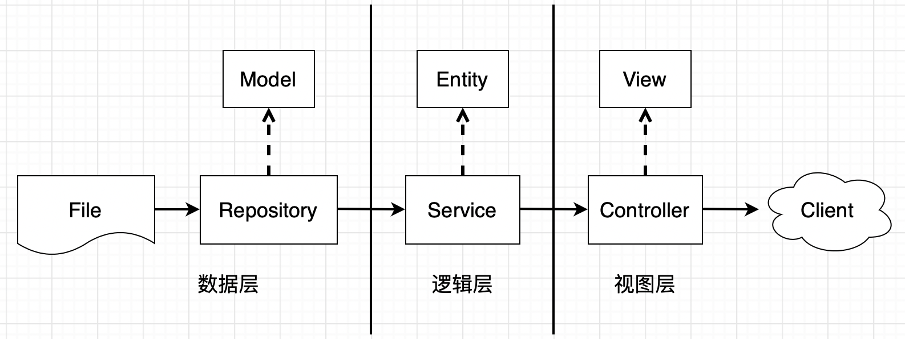

```json
{
  "date":"2022.01.17 13:20",
  "author":"XinceChan",
  "tags":["Golang"],
  "musicId":"1948620191"
}
```

本章将从工程实践角度，讲授在企业项目实际开发过程中的所遇的难题，重点讲解Go语言的进阶之路，以及在其依赖管理过程中如何演进。包括：1、语言进阶，从并发编程的视角带大家了解Go高性能的本质；2、依赖管理，了解Go语言依赖管理的演进路线；3、测试，从单元测试实践出发，提升大家的质量意识；4、项目实战，通过项目需求、需求拆解、逻辑设计、代码实现带领大家感受下真正的项目开发。

>本节讲述 4、项目实战，通过项目需求、需求拆解、逻辑设计、代码实现带领大家感受下真正的项目开发

### 需求描述

**社区话题页面**

1. 展示话题（标题，文字描述）和回帖列表
2. 暂不考虑前端页面实现，仅仅实现一个本地web服务
3. 话题和回帖数据用文件存储


