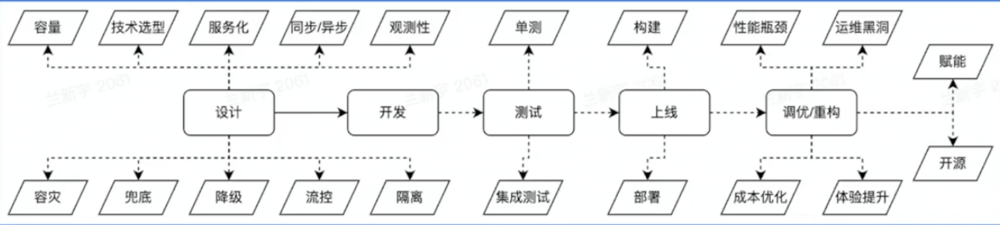
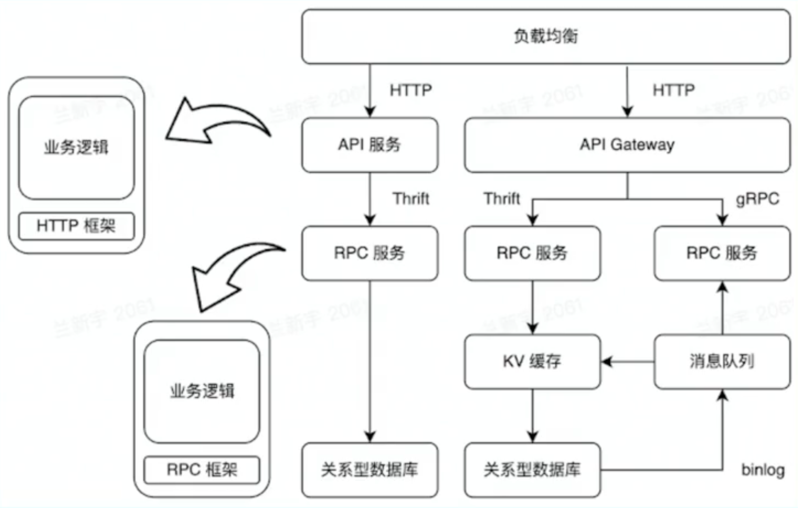
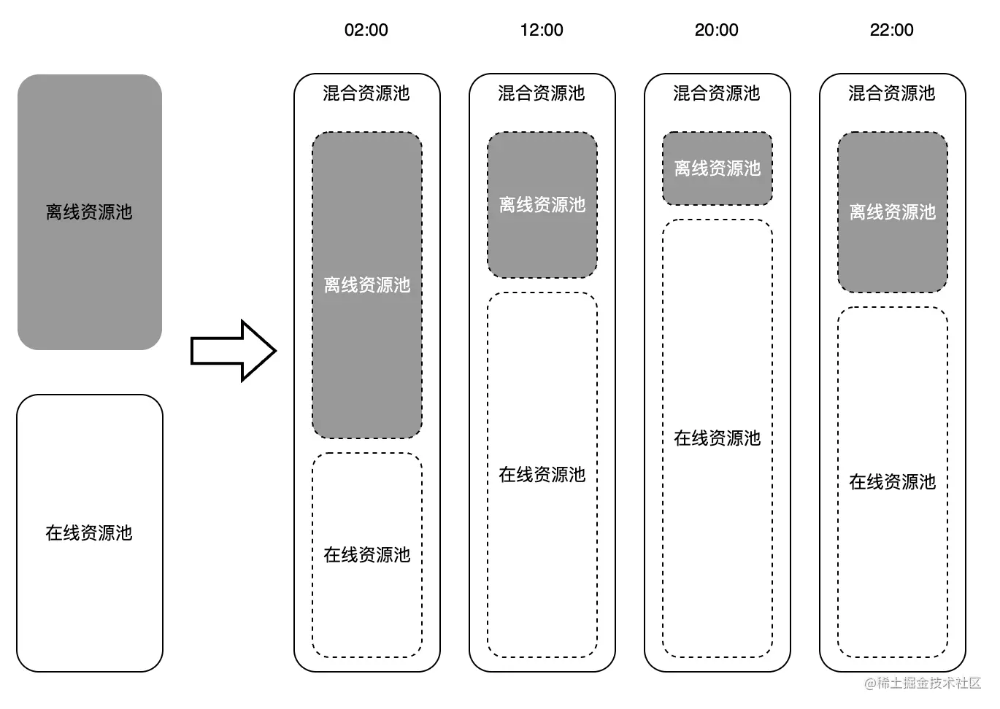

```json
{
    "date":"2023.02.01 14:30",
    "author":"XinceChan",
    "tags":["Golang","架构"],
    "musicId":"5179543"
}
```

架构，又称软件架构，

- 是有关软件整体结构与组件的抽象描述
- 用于指导软件系统各个方面的设计

实现一个软件有很多种方法，架构在方法选择上起着至关重要的指导作用

### 什么是架构 - 单机

软件系统需要具备对外提供服务，单机，就是把所有功能都实现在一个进程里，并部署在一台机器上

优点：

- 简单

问题：

- [C10K problem](http://www.kegel.com/c10k.html)
- 运维需要停服

### 什么是架构 - 单体、垂直应用｜垂直切分

单体架构：分布式部署

垂直应用架构：按应用垂直切分的单体

优点：

- 水平扩容
- 运维不需要停服

问题：

- 职责太多，开发效率不高
- 爆炸半径大

### 什么是架构 - SOA、微服务｜水平切分

SOA 架构中，服务为一等公民，将进程按照不同的功能单元进行抽象，拆分为『服务』。有了服务之后，SOA 还为服务之间的通信定义了标准，保证各个服务之间通讯体验的一致性。

SOA（Service-Oriented Architecture）

1. 将应用的不同功能单元抽象为服务
2. 定义服务之间的通信标准

微服务架构：SOA的去中心化演进方向

### 企业后端架构剖析 - 云计算

云计算：是指通过软件自动化管理，提供计算资源的服务网络，是现代互联网大规模熟悉分析和存储的基石。

基础：

- 虚拟化技术 - 整租 vs 合租
  - 硬件层面（VM 虚拟机）- KVM/Xen/VMware
  - 操作系统层面（Container 容器）- LCX/Docker/Kata Container
  - 网络层面 - Linux Bridge/Open v Switch
- 编排方案 - 业主 vs 租赁平台
  - VM - OpenStack/VMWare Workstation
  - Container - Kubernetes/Docker Swarm

架构：

- IaaS（Infrastructure as a Service)
  - 云基础设施，对底层硬件资源池的抽象
  - 买房子 vs 房屋租赁平台
- PaaS（Platform as a Service）
  - 基于资源池抽象，对上层提供的弹性资源平台
  - 清包 vs 全包
- Saas（Software as a Service）
  - 基于弹性资源平台构建的云服务
  - 从零培训 vs 雇佣培训过的师傅
- FaaS（Function as a Service）
  - 更轻量级的函数服务。好比 LeetCode 等 OJ，刷题时只需要实现函数，不需要关注输入输出流
  - 纯手工制作 vs 蛋糕机批量生产

### 企业后端架构剖析 - 云原生

云原生技术为组织（公司）在公有云、自由云、混合云等新型的动态环境中，构建和运行可弹性拓展的应用提供了可能。

- 弹性资源
  - 虚拟化容器 - 计算资源
  - 快速扩缩容 - 存储资源
- 微服务架构
  - 业务功能单元解锁
  - 统一的通信标准
- DevOps
  - 敏捷开发
  - CI/CD
- 服务网格
  - 业务与治理解构
  - 异构系统的治理统一化
  - 复杂治理能力

#### 弹性资源

基于虚拟化技术，提供的可以快速扩缩容的能力。可以分为弹性计算资源和弹性存储资源两个方面。

**弹性计算资源类型：**

- 服务资源调度
- 计算资源调度
  - 在线计算 - 互联网后端服务
  - 离线计算 - 大数据分析。Map-Reduce/Spark/Flinnk
- 消息队列
  - 在线队列 - 削峰、解耦
  - 离线队列 - 结合数据分析的一整套方案，如 ELK

**弹性存储资源类型：**

- 经典存储

  - 对象存储 - 视频、图片等。结合 CDN 等技术，可以为应用提供丰富的多媒体能力

  - 大数据存储 - 应用日志、用户数据等。结合数据挖掘、机器学习等技术，提高应用的体验

- 关系型数据库

- 元数据
  - 服务发现

- NoSQL

  - KV 存储 - Redis

  - 文档存储 - Mongo

#### DevOps

`DevOps` 是云原生时代软件交付的利器，贯穿整个软件开发周期。

结合自动化流程，提高软件开发、交付效率



#### 微服务架构

**通信标准：**

- HTTP（RESTful API）
- RPC（Thrift，gRPC）

如何在 HTTP 和 RPC 之间选择？

- 性能 - RPC 协议往往具备较好的压缩率，性能较高。如 Thrift, Protocol Buffers
- 服务治理 - RPC 中间件往往集成了丰富的服务治理能力。如 熔断、降级、超时等
- 可解释性 - HTTP 通信的协议往往首选 JSON，可解释性、可调试性更好

云原生场景下，微服务大可不必在业务逻辑中实现符合通信标准的交互逻辑，而是交给框架来做。



#### 服务网格（Service Mesh）：

- 微服务之间通讯的中间层
- 高性能网络代理
- 业务代码与治理解耦

相比较于 RPC/HTTP 框架：

- 实现了异构系统治理体验的统一化
- 服务网格的数据平面代理与业务进程采取进程间通信的模式，使得流量相关的逻辑（包含治理）与业务进程解耦，生命周期也更容易管理

## 企业后端架构的挑战

#### 挑战

- 基础设施层面：
  - 物理资源是有限的
    - 机器
    - 带宽
  - 资源利用率受制于服务部署

- 用户层面：
  - 网络通信开销较大
  - 网络抖动导致运维成本提高
  - 异构环境下，不同实例资源水位不均

### 离在线资源并池

核心收益：

- 提高物理资源利用率
- 提供更多的弹性资源，增加收入

解决思路：离在线资源并池

- 在线业务的特点
  - `IO` 密集型为主
  - 潮汐性、实时性
- 离线业务的特点
  - 计算密集型占多数
  - 非实时性



### 自动扩缩容

核心收益：

- 降低业务成本

解决思路：**自动扩缩容**

- 利用在线业务潮汐性自动扩缩容

### 微服务亲和性部署

核心收益：

- 降低业务成本
- 提高服务可用性

解决思路：**微服务亲和性部署**

- 将满足亲和性条件的容器调度到一台宿主机
- 微服务中间件与服务网格通过共享内存通信
- 服务网格控制面实施灵活、动态的流量调度

### 流量治理

核心收益：

- 提高微服务调用容错性
- 容灾
- 进一步提高开发效率，`DevOps` 发挥到极致

解决思路：**基于微服务中间件 && 服务网格的流量治理**

- 熔断、重试
- 单元化
- 复杂环境（功能、预览）的流量调度

### CPU水位负载均衡

核心收益：

- 打平异构环境算力差异
- 为自动扩缩容提供正向输入

解决思路：**CPU水位负载均衡**

- IaaS
  - 提供资源探针
- 服务网格
  - 动态负载均衡

