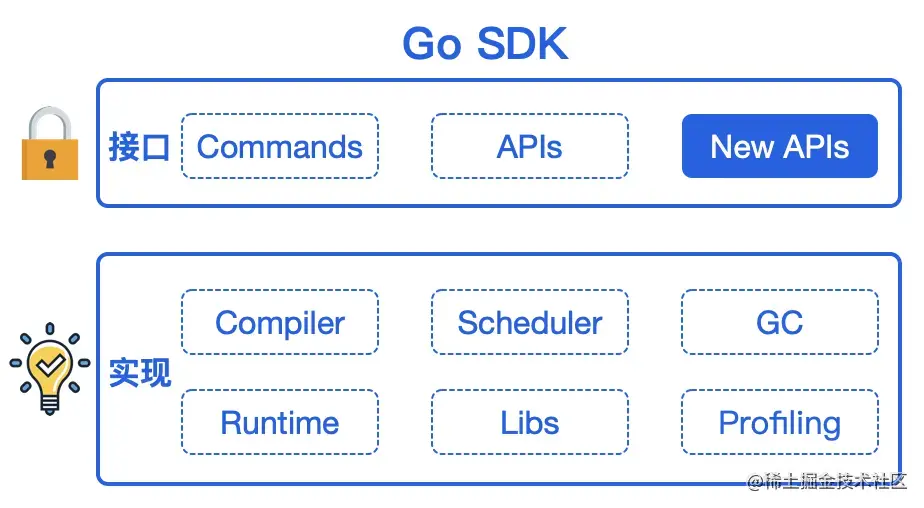
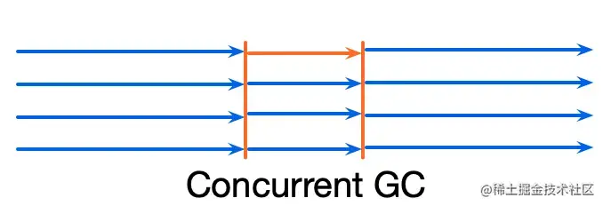
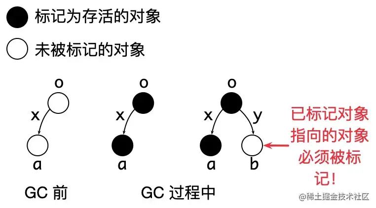
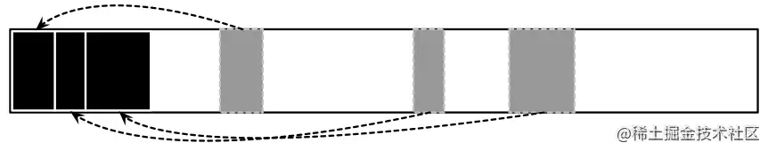
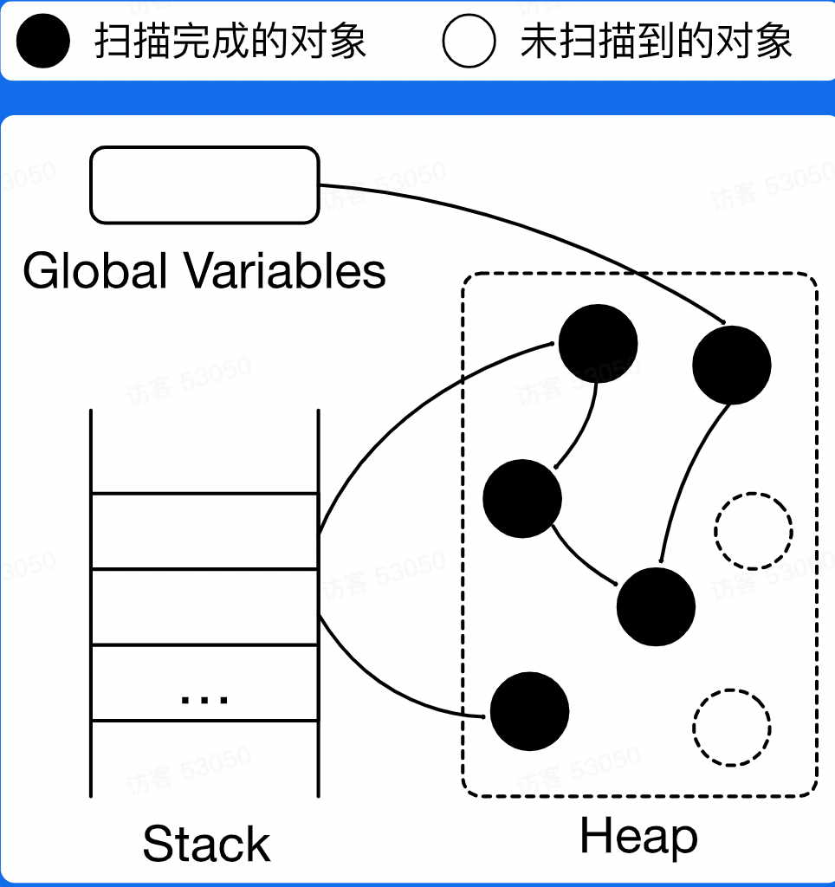
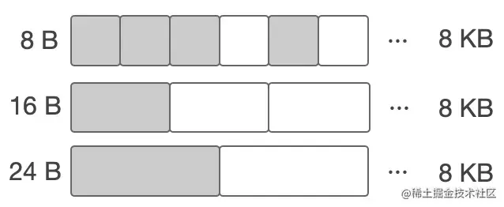
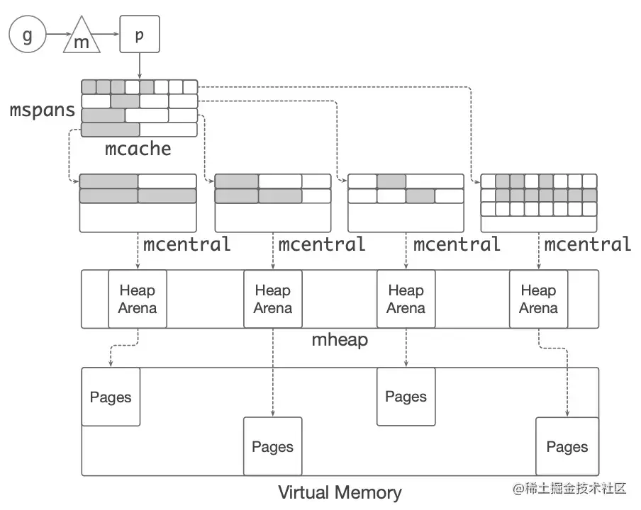
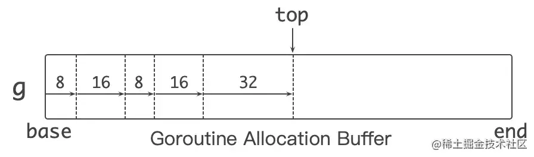
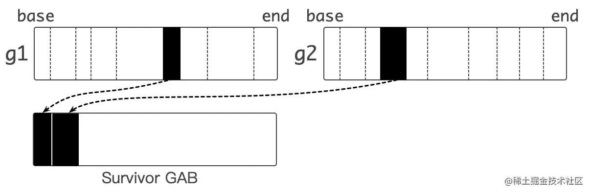
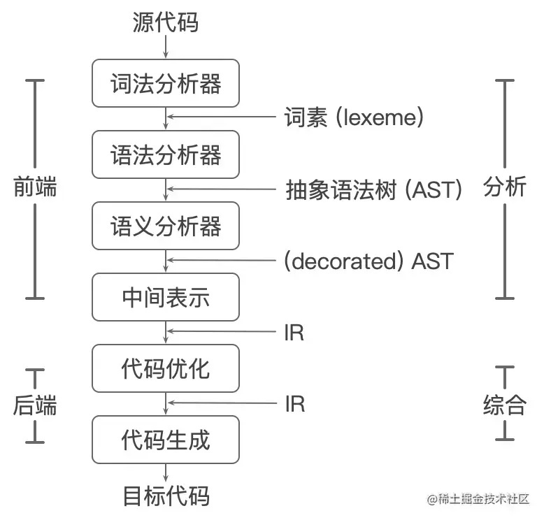

```json
{
    "date":"2023.01.19 16:30",
    "author":"XinceChan",
    "tags":["Golang","性能优化"],
    "musicId":"330107"
}
```

本节课将主要介绍关于高性能 Go 语言发行版优化的内存管理优化，分享自动内存管理与 Go 内存管理知识，提供可行性的优化建议。

## 性能优化

### 追求极致性能

- **性能优化是什么？**
  - 提升软件系统处理能力，减少不必要的消耗，充分发挥计算机算力
- **为什么要做性能优化？**
  - 用户体验：带来用户体验的提升 —— 让刷抖音更丝滑，让双十一购物不再卡顿
  - 资源高效利用：降低成本，提高效率 —— 很小的优化乘以海量机器会是显著的性能提升和成本节约

### 性能优化的层面

- 业务层优化
  - 针对特定场景，具体问题，具体分析
  - 容易获得较大性能收益
- 语言运行时优化
  - 解决更通用的性能问题
  - 考虑更多场景
  - Tradeoffs

- 数据驱动
  - 自动化性能分析工具 —— pprof
  - 依靠数据而非猜测
  - 首先优化最大瓶颈

### 性能优化与软件质量

- 软件质量至关重要
- 在保证接口稳定的前提下改进具体实现
- 测试用例：覆盖尽可能多的场景，方便回归
- 文档：做了什么，没做什么，能达到怎样的效果
- 隔离：通过选项控制是否开启优化
- 可观测：必要的日志输出



---

## 自动内存管理

- 动态内存
  - 程序在运行时根据需求动态分配的内存：malloc()
- 自动内存管理（垃圾回收）：由程序语言的运行时系统管理动态内存
  - 避免手动内存管理，专注于实现业务逻辑
  - 保证内存使用的正确性和安全性：double-free problem, use-after-free problem
- 三个任务
  - 为新对象分配空间
  - 找到存货对象
  - 回收死亡对象的内存空间

### 相关概念

- Mutator：业务线程，分配新对象，修改对象指向关系
- Collector：GC线程，找到存活对象，回收死亡对象的内存空间
- Serial GC：只有一个collector
  - 

- Parallel GC：支持多个collectors同时回收的GC算法
  - 

- Concurrent GC：mutator(s) 和 collector(s) 可以同时执行
  - Collectors必须感知对象指向关系的改变！
  - 
  - 

- 评估GC算法
  - 安全性（Safety）：不能回收存活的对象 —— 基本要求
  - 吞吐率（Throughput）：$1-\frac{GC时间}{程序执行总时间}$ —— 花在GC上的时间
  - 暂停时间（Pause time）：stop the world（STW）—— 业务是否感知
  - 内存开销（Space overhead）： GC元数据开销
- 追踪垃圾回收（Tracing garbage collection）
- 引用计数（Reference counting）

### 追踪垃圾回收

- 对象被回收的条件：指针指向关系不可达的对象
- 标记根对象
  - 静态变量、全局变量、常量、线程栈等
- 标记：找到可达对象
  - 求指针指向关系的传递闭包；从根对象出发，找到所有可达对象
- 清理：所有不可达对象
  - 将存活的对象复制到另外的内存空间（Copying GC）
    - 
  - 将死亡对象的内存标记为“可分配“（Mask-sweep GC）
    - 
  - 移动并整理存活对象（Mark-compact GC）
    - 
- 根据对象的生命周期，使用不同的标记和清理策略



### 分代GC（Generational GC）

- 分代假说（Generational hypothesis）：most objects die young
- Intuition：很多对象在分配出来后很快就不再使用了
- 每个对象都有年龄：经历过GC的次数
- 目的：对年轻和老年的对象，制定不同的GC策略，降低整体内存管理的开销
- 不同年龄的对象处于heap的不同区域

- 年轻代（Young generation）
  - 常规的对象分配
  - 由于存活对象很少，可以采用copying collection
  - GC吞吐量很高
- 老年代（Old generation）
  - 对象趋向于一直活着，反复复制开销较大
  - 可以采用mark-sweep collection

### 引用计数

- 每个对象都有一个与之关联的引用书目
- 对象存活的条件：当且仅当引用数大于0

- 优点
  - 内存管理的操作被平摊到程序执行过程中
  - 内存管理不需要了解runtime的实现细节：C++智能指针（smart pointer）
- 缺点
  - 维护引用计数的开销较大：通过原子操作保证对引用计数操作的原子性和可见性
  - 无法回收环形数据结构 —— week reference
  - 内存开销：每个对象都引入的额外内存空间存储饮用数目
  - 回收内存时依然可能引发暂停

---

## Go内存管理及优化

### Go内存分配 —— 分块

- 目标：为对象在heap上分配内存
- 提前将内存分块
  - 调用系统调用 `mmap()` 向 OS 申请一大块内存，例如4MB
  - 先将内存划分成大块，例如 8 KB，称作 `mspan`
  - 再将大块继续划分成特定大小的块，用于对象分配
  - noscan mspan：分配不包含指针的对象 —— GC不需要扫描
  - scan mspan：分配包含指针的对象 —— GC需要扫描
- 对象分配：根据对象的大小，选择最合适的块返回



### Go内存分配 —— 缓存

- TCMalloc：thread caching
- 每个p包含一个 mcache 用于快速分配，用于为绑定于 p 上的 g 分配对象
- mcache 管理一组 mspan
- 当 mcache 中的 mspan 分配完毕，向 mcentral 申请带有未分配块的 mspan
- 当 mspan 中没有分配的对象，mspan 会被缓存在 mcentral 中，而不是立刻释放并归还给 OS



### Go内存管理优化

- 对象分配是非常高频的操作：每秒分配 GB 级别的内存
- 小对象占比较高
- Go 内存分配比较耗时
  - 分配路径长： g -> m -> p -> mcache -> span -> memory block -> return pointer
  - pprof：对象分配的函数是最频繁调用的函数之一

### Balanced GC

- 每个 g 都绑定一大块内存（1 KB），称作goroutine allocation buffer （GAB）
- GAB 用于 noscan 类型的小对象分配：< 128 B
- 使用三个指针维护GAB：base, end, top
- Bump pointer（指针碰撞）风格对象分配
  - 无须和其他分配请求互斥
  - 分配动作简单高效



```go
if g.ab.end - g.ab.top < size {
    // Allocate a new allocation buffer
}
addr := g.ab.top
g.ab.top += size
return addr
```

- 分配对象时，根据对象大小移动 `top` 指针并返回，快速完成一次对象分配

- 同原先调用 `mallocgc()` 进行对象分配的方式相比，balanced GC 缩短了对象分配的路径，减少了对象分配执行的指令数目，降低 CPU 使用

- GAB 对于Go内存管理来说是一个大对象
- 本质：**将多个小对象的分配合并成一次大对象的分配**

- 问题： GAB 的对象分配方式会导致内存被延迟释放

- 方案：移动 GAB 中存活的对象
  - 当 GAB 中哪怕只有一个小对象存活时，Go runtime 也会认为整个大对象（即 GAB）存活。为此，balanced GC 会根据 GC 策略，**将 GAB 中存活的对象移动到另外的 GAB 中**，从而压缩并清理 GAB 的内存空间，原先的 GAB 空间由于不再有存活对象，
  - 当 GAB 总大小超过一定阈值时，将 GAB 中存活的对象复制到另外分配的 GAB 中
  - 原先的 GAB 可以释放，避免内存泄漏
  - 本质： **用copyinng GC的算法管理小对象**



---

## 编译器和静态分析

### 编译器的结构

- 重要的系统软件
  - 识别符合语法和非法的程序
  - 生成正确且高效的代码
- 分析部分（前端 front end）
  - 词法分析，生成词素（lexeme）
  - 语法分析，生成语法树
  - 语义分析，收集类似信息，进行语义检查
  - 中间代码生成，生成 intermediate representation(IR)
- 综合部分（后端 back end）
  - 代码优化，机器无关优化，生成优化后的 IR
  - 代码生成，生成目标代码



### 静态分析

- 静态分析：不执行程序代码，推导程序的行为，分析程序的性质
- 控制流（Control flow）：程序执行的流程
- 数据流（Data flow）：数据在控制流上的传递

- 通过分析控制流和数据流，我们可以知道更多关于程序的性质（properties）
  - 根据这些性质优化代码

### 过程内分析和过程间分析

- 过程内分析（Intra-procedural analysis）
  - 仅在函数内部进行分析
- 过程间分析（Inter-procedural analysis）
  - 考虑函数调用时参数传递和返回值的数据流和控制流

- 为什么过程间分析是个问题？
  - 需要通过数据流分析得知i的具体类型，才能知道 i.foo() 调用的哪个 foo()
  - 根据 i 的具体类型，产生了新的控制流，i.foo()，分析继续
  - 过程间分析需要同时分析控制流和数据流 —— 联合求解，比较复杂

---

## Go编译器优化

- 为什么做编译器优化
  - 用户无感知，重新编译即可获得性能收益
  - 通用性优化
- 现状
  - 采用的优化少
  - 编译时间较短，没有进行较复杂的代码分析和优化
- 编译优化的思路
  - 场景：面向后端长期执行任务
  - Tradeoff：**用编译时间换取更高效的机器码**

- Beast mode
  - 函数内联
  - 逃逸分析
  - 默认栈大小调整
  - 边界检查消除
  - 循环展开
  - ......

### 函数内联（lnlining）

- 内联：将被调用函数的函数体（callee）的副本替换到调用位置（caller）上，同时重写代码以反映参数的绑定
- 优点
  - 消除函数调用开销，例如传递参数、保存寄存器等
  - 将过程间分析转化为过程内分析，帮助其他优化，例如逃逸分析

- 缺点
  - 函数体变大，instruction cache（icache）不友好
  - 编译生成的 Go 镜像变大
- 函数内联在大多数情况下是正向优化
- 内联策略
  - 调用和被调函数的规模

### Beast Mode

- Go函数内联受到的限制较多
  - 语言特性，例如interface, defer等，限制了函数内联
  - 内联策略非常保守
- Beast Mode：调整函数内联的策略，使更多函数被内联
  - 降低函数调用的开销
  - 增加了其他优化的机会：逃逸分析
- 开销
  - Go镜像增加 ~10%
  - 编译时间增加

### 逃逸分析

- 逃逸分析：分析代码中指针的动态作用域：指针在何处可以被访问
- 大致思路
  - 从对象分配处出发，沿着控制流，观察对象的数据流
  - 若发现指针 p 在当前作用域 s：
    - 作为参数传递给其他参数
    - 传递给全局变量
    - 传递给其他的 goroutine
    - 传递给已逃逸的指针指向的对象
  - 则指针 p 指向的对象逃逸出 s，反之则没有逃逸出 s
- Beast Mode：函数内联拓展了函数边界，更多对象不逃逸
- 优化：未逃逸的对象可以在栈上分配
  - 对象在栈上分配和回收很快：移动 sp
  - 减少在 heap 上的分配，降低 GC 负担