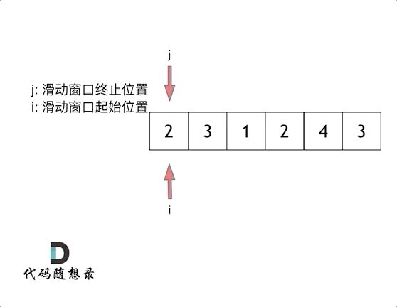

```json
{
    "date": "2023.03.13 9:30",
    "author": "努力改变的阿策",
    "tags": ["Leetcode", "数组", "滑动窗口"],
    "musicId": "1388891420",
}
```

## 209. 长度最小的子数组

给定一个含有 `n` 个正整数的数组和一个正整数 `target` **。**

找出该数组中满足其和 `≥ target` 的长度最小的 **连续子数组** `[numsl, numsl+1, ..., numsr-1, numsr]` ，并返回其长度**。**如果不存在符合条件的子数组，返回 `0` 。 

**示例 1：**

```
输入：target = 7, nums = [2,3,1,2,4,3]
输出：2
解释：子数组 [4,3] 是该条件下的长度最小的子数组。
```

**示例 2：**

```
输入：target = 4, nums = [1,4,4]
输出：1
```

**示例 3：**

```
输入：target = 11, nums = [1,1,1,1,1,1,1,1]
输出：0
```

**提示：**

- `1 <= target <= 109`
- `1 <= nums.length <= 105`
- `1 <= nums[i] <= 105`

**进阶：**

- 如果你已经实现 `O(n)` 时间复杂度的解法, 请尝试设计一个 `O(n log(n))` 时间复杂度的解法。

## 思路

### 滑动窗口

所谓滑动窗口，就是不断调整子序列的起始位置和终止位置，从而得到我们想要的结果。



在本题中实现滑动窗口，主要确定如下三点：

- 窗口内是什么？
- 如何移动窗口的起始位置？
- 如何移动窗口的结束位置？

窗口就是 满足其和 ≥ s 的长度最小的 连续 子数组。

窗口的起始位置如何移动：如果当前窗口的值大于s了，窗口就要向前移动了（也就是该缩小了）。

窗口的结束位置如何移动：窗口的结束位置就是遍历数组的指针，也就是for循环里的索引。


可以发现**滑动窗口的精妙之处在于根据当前子序列和大小的情况，不断调节子序列的起始位置。从而将O(n^2)暴力解法降为O(n)。**

```c++
class Solution {
public:
    int minSubArrayLen(int target, vector<int>& nums) {
        int res = INT32_MAX;
        int sum = 0; // 滑动窗口数值之和
        int i = 0; // 滑动窗口起始位置
        int subLength = 0; // 滑动窗口的长度
        for (int j = 0; j < nums.size(); j++) {
            sum += nums[j];
            // 注意这里使用while，每次更新 i（起始位置），并不断比较子序列是否符合条件
            while (sum >= s) {
                subLength = (j - i + 1); // 子序列的长度
                res = res < subLength ? res : subLength;
                sum -= nums[i];
            }
        }
        // 如果result没有被赋值的话，就返回0，说明没有符合条件的子序列
        return result == INT32_MAX ? 0 : result;
    }
}
```