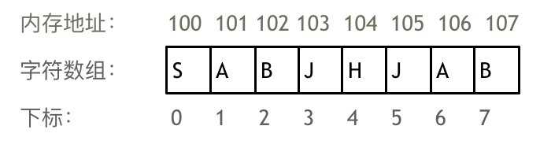
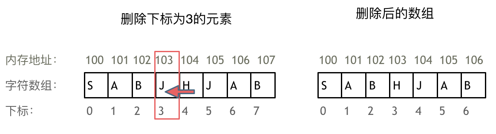

```json
{
    "date": "2023.03.10 22:00",
    "author": "努力改变的阿策",
  	"tags":["Leetcode","数组"],
  	"musicId":"1429355183"
}
```

数组是非常基础的数据结构，考察数组的题目一般在思维上都不难，主要是考察对代码的掌握能力。

首先要知道数组在内存中的存储方式，这样才能真正理解数组相关的面试题

**数组是存放在连续内存空间上的相同类型数据的集合。**

数组可以方便的通过下标索引的方式获取到下标下对应的数据。

举一个字符数组的例子，如图所示：



需要两点注意的是

- **数组下标都是从0开始的。**
- **数组内存空间的地址是连续的**

正是**因为数组的在内存空间的地址是连续的，所以我们在删除或者增添元素的时候，就难免要移动其他元素的地址。**

例如删除下标为3的元素，需要对下标为3的元素后面的所有元素都要做移动操作，如图所示：



**那么二维数组在内存的空间地址是连续的么？**

不同编程语言的内存管理是不一样的，以C++为例，在C++中二维数组是连续分布的。

```c++
void test_arr() {
    int array[2][3] = {
		{0, 1, 2},
		{3, 4, 5}
    };
    cout << &array[0][0] << " " << &array[0][1] << " " << &array[0][2] << endl;
    cout << &array[1][0] << " " << &array[1][1] << " " << &array[1][2] << endl;
}

int main() {
    test_arr();
}
```

测试地址为

```c++
0x7ffee4065820 0x7ffee4065824 0x7ffee4065828
0x7ffee406582c 0x7ffee4065830 0x7ffee4065834
```

注意地址为16进制，可以看出二维数组地址是连续一条线的。

而Java的二维数组不相同，可能下面这种排列方式。

