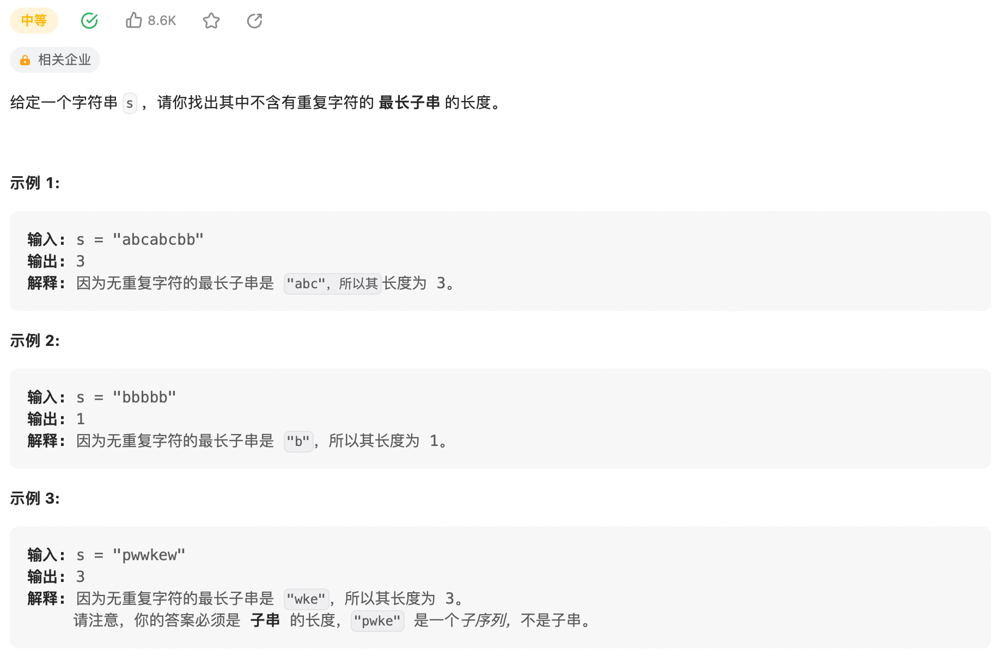

```json
{
  "date":"2023.01.18 23:52",
  "author":"XinceChan",
  "tags":["Leetcode","滑动窗口"],
  "musicId":"30621338"
}
```

说起滑动窗口算法，有时候真的会让我很头疼。这个算法技巧的思路非常简单，就是维护一个窗口，不断滑动，然后更新答案。LeetCode上起码有10道运用滑动窗口算法的题目，难度都是中等和困难。

其实困扰大家的，不是算法的思路，而是各种细节问题。比如说如何向窗口中添加新元素，如何缩小窗口，在窗口滑动的哪个阶段更新结果。即便你明白了这些细节，也容易出 bug，找 bug 还不知道怎么找，真的挺让人心烦的。

参照labuladong的算法小抄，写一套golang的滑动窗口算法的代码框架，以后遇到相关的问题，就默写出如下框架然后改三个地方就行，还不会出bug。

> 放置滑动窗口解题的模板，方便之后自己记忆。

```go
// 滑动窗口算法框架 - golang版本
func slidingWindow(s string) {
  	// 哈希表
  	window := map[byte]int{}
  	left, right := 0, 0
  	for right < len(s) {
    		// c是将移入窗口的字符
    		c := s[right]
    		// 增大窗口
    		right++
    		// 进行窗口内数据的一系列更新
    		...
    
    		/* debug 输出的位置 */
    		// 注意在最终的解法代码中不要print
    		// 因为 IO 操作很耗时，可能导致超时
    		fmt.Printf("window: [%d, %d]\n", left, right)
    		/* ************** */
    
    		// 判断左侧窗口是否要收缩
    		while (windows needs shrink) {
      		// d是需要移出窗口的字符
      		d := s[left]
      		// 缩小窗口
      		left++
      		// 进行窗口内数据的一系列更新
      		...
    		}
  	}
}
```

### 3. 无重复字符的最长子串

先来看看 Leetcode 第 3 题「无重复字符的最长子串」 难度中等



```go
func lengthOfLongestSubstring(s string) int {
    window := map[byte]int{}
    n := len(s)
    left, right, res := 0, 0, 0
    for right < n {
        // c是移入窗口的字符
        c := s[right]
        // 增大窗口
        right++
       // 进行窗口内数据的一系列更新
        window[c]++
        // 判断左侧窗口是否要收缩 -- 本题条件为不含有重复字符的最长子串
        for window[c] > 1 {
            // d是需要移出窗口的字符
            d := s[left]
            // 缩小窗口
            left++
            // 进行窗口内数据的一系列更新
            window[d]--
        }
        res = max(res, right-left)
    }
    return res
}

func max(a, b int) int {
    if a > b {
        return a
    }
    return b
}
```


