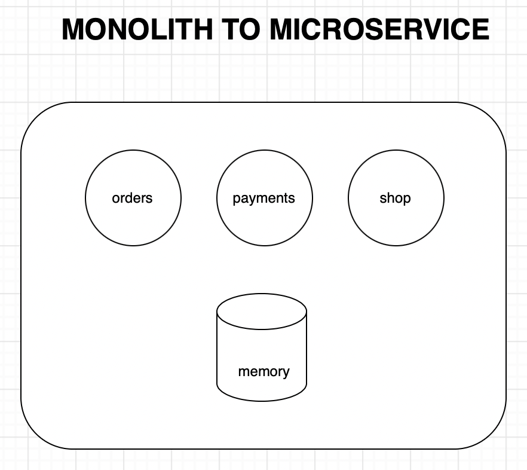

```json
{
  "date": "2022.01.15 18:17",
  "tags": ["Golang", "微服务"],
  "author": "XinceChan",
  "musicId": "1959547786"
}
```

> Monolith to Microservice - A Golang Projects Series!
>
> 这个章节将分为几个章节，用来展示这个项目的核心思路，部分代码等。

### MONOLITH TO MICROSERVICE

**系统架构**



