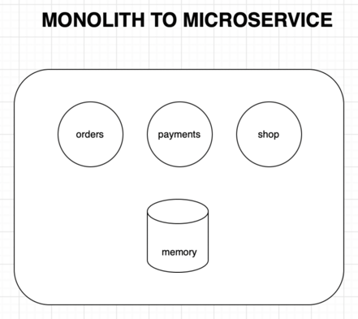

```json
{
  "date": "2022.01.15 18:17",
  "tags": ["Golang", "微服务"],
  "author": "XinceChan",
  "musicId": "1959547786"
}
```

一直想了解一下微服务究竟是什么东西，该如何去实现。刚才在YouTube上看到关注的youtuber有相关介绍golang微服务的视频，之前看了一点简单的做了了解。这次跟着视频做一个建议的项目看看能不能实现这个内容。

Monolith to Microservice - A Golang Projects Series!

这个章节将分为几个章节，用来展示这个项目的核心思路，部分代码等。

### MONOLITH TO MICROSERVICE

**系统架构**



**微服务架构**
