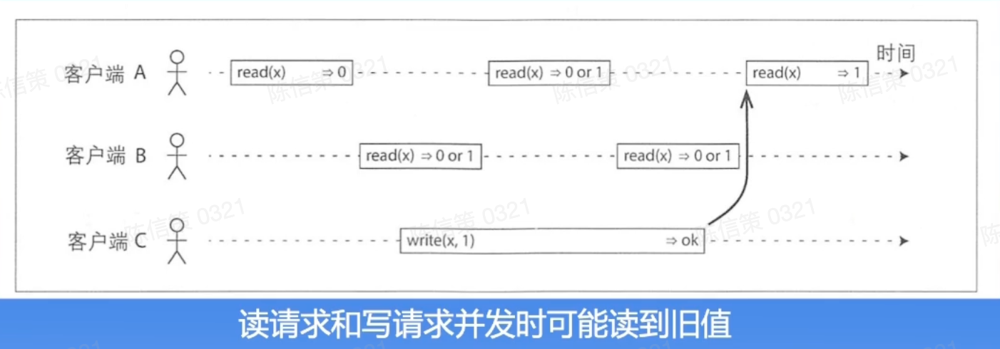
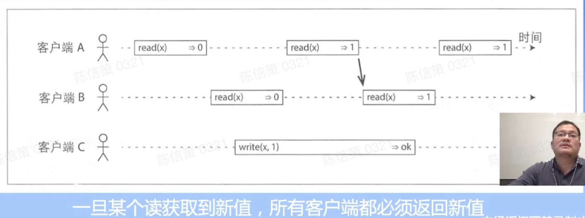

```json
{
    "date":"2023.02.02 13:30",
    "author":"XinceChan",
    "tags":["分布式理论"],
    "musicId":""
}
```

分布式系统是计算机程序的集合，这些程序利用跨多个独立计算节点的计算资源来实现共同的目标。可以分为分布式计算、分布式存储、分布式数据库等。

### 分布式概述

- 使用分布式系统的五大优势：去中心化、低成本、弹性、资源共享、可靠性高
- 分布式系统的挑战：故障、网络、环境、安全

#### Why-How-What

- 使用者视角
  - Why：
    - 数据爆炸，对存储和计算有大规模运算的诉求
    - 成本低，构建在廉价服务器之上
  - How：
    - 分布式框架
    - 成熟的分布式系统
  - What：
    - 理清规模，负载，一致性要求等。
    - 明确稳定性要求，制定技术方案
- 学习者视角：
  - Why：
    - 后端开发必备技能
    - 帮助理解后台服务器之间协作的机理
  - How：
    - 掌握分布式理论
    - 了解一致性协议
  - What：
    - 把要点深入展开，针对难点搜索互联网资料进行
    - 将所学知识运用于实践

### 常见的分布式系统

- 分布式存储：GFS、Ceph、HDFS、Zookeeper
- 分布式数据库：Spanner、TiDB、HBase、MangoDB
- 分布式计算：Hadoop、YARN、Spark

## 系统模型

### 故障模型

- Byzantine failure：节点可以任意篡改发送给其他节点的数据
- Authentication detectable byzantine failure（ADB）：Byzantine failure的特例；节点可以篡改数据，但不能伪造其他节点的数据
- Performance failure：节点未在特定时间段内收到数据，即时间太早或太晚
- Omission failure：节点收到数据的时间无限晚，即收不到数据
- Crash failure：在omission failure的基础上，增加了节点停止响应的假设，也即持续性地omission failure
- fail-stop failure：在crash failure的基础上增加了错误可检测的假设

|         故障         |                            描述                            |      可能的类型       |
| :------------------: | :--------------------------------------------------------: | :-------------------: |
|       磁盘故障       |    如：磁头不寻道、盘片不转、磁介质损伤等。年发生率1-2%    |       Fail-stop       |
|    磁盘坏道、坏块    |     磁头划伤引起坏道，或受宇宙射线影响晶体管发生位反转     |    Fail-stop，ADB     |
| 服务器主板、板卡故障 | 可能是风扇故障，或灰尘引起的短路，或SCSI/RAID卡造成的死机  |         Crash         |
|       网络故障       | 电源故障、背板故障等，网卡位反转、网络流量大造成大量丢包等 |   Byzantine failure   |
|       网络分区       | 网络引起节点形成不同的子集，子集中网络相通，子集间网络不通 |      Performance      |
|       内存故障       |          内存出错造成的数据被篡改，分为UE、CE两种          |          ADB          |
|       线缆故障       |                  服务器光模版频繁up或down                  | Performance，omission |
|       内核崩溃       |           内核内部的致命错误，产生的kernel panic           |         Crash         |
|       CPU故障        |                       年故障率接近1%                       |    Omission、Crash    |
|       电源故障       |                     服务器失去电力支撑                     |       Omission        |
|       软件故障       |  如：进程crash、内存踩坏、状态不一致、配置错误、软件bug等  |   Byzantine failure   |

### 拜占庭将军问题

引入：两将军问题（Two General‘s Problem）：两支军队的将军只能派信使穿越敌方领土互相通信，以此约定进攻时间。该问题希望求解如何在两名将军派出的任何信使都可能被俘虏的情况下，就进攻时间达成共识。

结论是，两将军问题是被证实无解的电脑通信问题，两支军队理论上永远无法达到共识。

方案一：同时发送 N 个信使，任何一个达到对方军队，都算成功。

方案二：设置超时时间，发送后未在一定时间返回，则加派信使。

共识与消息传递的不同：即使保证了消息传递成功，也不能保证达成共识。

TCP 三次握手是在两个方向确认包的序列号，增加了超时重试，是两将军问题的一个工程解。

**三将军问题：**

- 两个“忠将”A和B，一个“叛徒”C，互相传递消息，消息可能丢失，也可能被篡改，当有一个将军是“叛徒”（即出现拜占庭故障）时，整个系统无法达成一致。
- 由于“叛徒”C的存在，将军A和将军B获得不同的信息。这样将军A获得2票进攻1票撤退的信息，将军B获得1票进攻2票撤退的信息，产生了不一致

**四将军问题：**

- 将军D作为消息分发中枢，约定如果没收到消息则执行撤退
- 步骤：
  - 如果D为“叛徒”，ABC无论收到任何消息，总能达成一致
  - D为“忠将”，ABC有2人将D的消息进行正确的传递，同样能保证最终决策符合大多数。
- 进而能够证明，当有3m+1个将军，m个“叛徒”时，可以进行m轮协商，最终达成一致

### 共识性和一致性

客户端`A`读到`x=0`，当客户端`C`正在写入时，客户端`A`和`B`可能读到`0`或者`1`。但是当`C`写入完成后，`A`和`B`最终能读到一致的数据。我们称这样的一致性为`Eventually consistent（最终一致性）`

当客户端`A`读到更新的版本`x=1`后，及时将消息同步给其他客户端，这样其他的客户端立即能获取到`x=1`。我们称这样的一致性为`Linearizability（线性一致性）`

如果要保证“线性”一致性，多个节点间势必需要进行协商，以寻求一致性。这样增加了延迟，系统可用性便会受损。





### 时间和事件顺序

- 1978年Leslie Lamport发表《*Time, Clocks, and the Ordering of Events in a Distributed System》*
  - 定义了计算机系统中的时间和事件顺序，引入*happened before*和并发的定义，可以以此对分布式系统中的事件进行推导
  - 根据上述推导，创造了Lamport逻辑时钟的概念，这个概念在分布式理论中具有革命性的意义，帮助我们在一系列分布式事件当中梳理出逻辑的先后关系。利用逻辑时钟，我们可以对整个系统中的事件进行全序排序

## 理论基础

### CAP理论

| 选项                      | 描述                                                         |
| ------------------------- | ------------------------------------------------------------ |
| C（Consistence）          | 一致性，指数据在多个副本之间能够保持一致的特性（严格的一致性）。 |
| A（Availability）         | 可用性，指系统提供的服务必须一直处于可用的状态，每次请求都能获取到非错的响应——但是不能保证获取的数据为最新数据 |
| P（Network partitioning） | 分区容错性，分布式系统在遇到任何网络分区故障的时候，仍然能够对外提供满足一致性和可用性的服务，除非整个网络环境都发生了故障。 |

CAP理论往往运用于数据库领域，同样可以适用于分布式存储方向。

- CA：放弃分区容错性，加强一致性和可用行，其实就是传统的单机数据库的选择
- AP：放弃一致性（这里说的一致性是强一致性），追求分区容错性和可用性，例如一些注重用户体验的系统
- CP：放弃可用性，追求一致性和分区容错性，例如与钱财安全相关的系统

### ACID理论

事务是数据库系统中非常重要的理论，它是数据库管理系统执行过程中的一个逻辑单元，它能够保证一个事务中的所有操作要么全部执行，要么全都不执行。

数据库事务拥有四个特性**ACID**，即分别是原子性（Atomicity）、一致性（Consistency）、隔离性（Isolation）和持久性（Durability）

- 原子性（A）。原子性是指事务包含的所有操作要么全部成功，要么全部失败回滚。
- 一致性（C）。一致性是指事务必须使数据库从一个一致性状态变换到另一个一致性状态，也就是说一个事务执行之前和执行之后必须处于一致性状态
- 隔离性（I）。隔离性是指当多个用户并发访问数据库的时候，数据库每一个用户开启的事务，不能被其他事务的操作所干扰，多个并发事务之间要相互隔离
- 持久性（D）。持久性是指一个事务一旦提交了，那么对数据库中的数据的改变就是永久性的，即便是在数据库系统遇到故障的情况下也不会丢失提交事务的操作。

### BASE理论

Base理论是对CAP中一致性和可用性权衡的结果，其来源是对大型互联网分布式实践的总结，是基于CAP定理逐步演化而来的。其核心思想是：

Basically Available（基本可用）：假设系统，出现了不可预知的故障，但还是能用，相比较正常的系统而言：响应时间上的损失，或功能上的损失

Soft state（软状态）：允许系统中的数据存在中间状态，并认为该状态不影响系统的整体可用性，即允许系统在多个不同节点的数据副本存在数据延迟。

Eventually consistent（最终一致性）：系统能够保证在没有其他新的更新操作的情况下，数据最终一定能够达到一致的状态，因此所有客户端对系统的数据访问最终都能够获取到最新的值。

## 分布式事务

### 二阶段提交

- 二阶段提交（Two-phase Commit）：为了使基于分布式系统架构下的所有节点在进行事务提交时保持一致性而设计的一种演算法。

三个假设：

- 引入协调者（Coordinator）和参与者（Participants），互相进行网络通信
- 所有节点都采用预写式日志，且日志被写入后即被保持在可靠的存储设备上
- 所有节点不会永久性损坏，即使损坏后仍然可以恢复

**正常流程**：`Prepare`阶段和`Commit`阶段

两阶段提交需注意的问题：

1. 性能问题

   两阶段提交需要多次节点间的网络通信，耗时过大，资源需要进行锁定，徒增资源等待时间。

2. 协调者单点故障问题

   如果事务协调者节点宕机，需要另起新的协调者，否则参与者处于中间状态无法完成事务。

3. 网络分区带来的数据不一致

   一部分参与者收到了commit消息，另一部分参与者没收到commit消息，会导致了节点之间的数据不一致。

### 三阶段提交

将两阶段提交中的 `Prepare`阶段，拆成两部分：`CanCommit`和`PreCommit`机制

解决了两个问题：

1. 单点故障问题
2. 阻塞问题

另外引入超时机制，在等待超时之后，会继续进行事务的提交。

### MVCC

悲观锁：操作数据时直接把数据锁住，直到操作完成后才会释放锁，上锁期间其他人不能修改数据

乐观锁：不会上锁，只是在执行更新时判断别人是否修改数据，只有冲突时才放弃操作

MVCC是一种并发控制的方法，维持一个数据的多个版本使读写操作没有冲突。所以既不会阻塞写，也不阻塞读。MVCC为每个修改保存一个版本，和事务的时间戳相关联。可以提高并发性能，解决脏读问题。

## 共识协议

### Quorum NWR模型

Quorum NWR三要素

- N：在分布式存储系统中，有多少份备份数据
- W：代表一次成功的更新操作要求至少有`W`份数据写入成功
- R：代表一次成功的读数据操作要求至少有`R`份数据成功读取

为了保证强一致性，需要保证 `W + R > N`

Quorum NWR模型将CAP的选择交给用户，是一种简化版的一致性模型。

- 引起的并发更新问题
  - 如果允许数据被覆盖，则并发更新容易引起一致性问题

### RAFT协议

Raft协议是一种分布式一致性算法（共识算法），即使出现部分节点故障，网络延时等情况，也不影响各节点，进而提高系统的整体可用性。Raft是使用较为广泛的分布式协议。一定意义上讲，RAFT也使用了Quorum机制。

Leader - 领导者，通常一个系统中是一主（Leader）多从（Follower）。Leader负责所有的客户端请求，并向Follower同步请求日志，当日志同步到大多数节点上后，通知Follower提交日志。

Follower - 跟随者，不会发送任何请求。接受并持久化Leader同步的日志，在Leader告知日志可以提交后，提交日志。当Leader出现故障时，主动推荐自己为Candidate。

Candidate - 备选者，Leader选举过程中的临时角色。向其他角色发送请求投票信息。如果获得大多数选票，则晋升为Leader。

Log（日志）：节点之间同步的信息，以只追加写的方式进行同步，解决了数据被覆盖的问题

Term（任期号）：单调递增，每个Term内最多只有一个Leader

Commited：日志被复制到多数派节点，即可认为已经被提交

Applied：日志被应用到本地状态机：执行了log中命令，修改了内存状态。

#### Leader选举过程

1. 初始全部为Follower
2. Current Term + 1
3. 选举自己
4. 向其他参与者发起RequestVote请求，retry直到
   - 收到多数派请求，成为Leader，并发送心跳
   - 收到其他Leader的请求，转为Follower，更新自己的Term
   - 收到部分，但未达到多数派，选择超时，随机timeout开始下一轮

两个规则

- 在一个任期内每个参与者最多投一票（持久化）
- 要成为Leader，必须拿到多数投票

#### Log Replication过程：

新Leader产生，Leader和Follower不同步，Leader强制覆盖Follower的不同步的日志。

1. Leader收到写请求w
2. 将w写入本地log
3. 向其他Follower发起AppendEntries RPC
4. 等待多数派回复
   - 更新本地状态机，返回给客户端
   - 下一个心跳通知Follower上一个Log已经被Committed另
   - Follower也根据命令应用本地状态机
5. Follower有问题，Leader一直retry

#### 切主

当Leader出现问题，就需要进行重新选举。

1. 当Leader发送失去Follower的响应，失去Follower身份
2. 两个Follower之间一段时间未收到心跳，重新进行选举，选出新的Leader，此时发生了切主
3. Leader自杀重启，以Follower的身份加入进来

#### Stale读

发送Leader切换，old leader收到了读请求。如果直接响应，可能会有stale read。如何解决？

解决方案，保证读的强一致性。

读操作是在lease timeout内，默认自己是leader；不是则发起一次heartbeat。等待Commit Index应用到状态机。

Election timeout > lease timeout ： 新Leader上任，自从上次心跳之后一定超过了Election timeout，旧leader大概率能够发现自己的Lease过期

### Paxos协议

- Paxos算法与RAFT算法区别：
  - Multi-Paxos 可以并发修改日志，而Raft写日志操作必须是连续的
  - Multi-Paxos 可以随机选主，不必最新最全的节点当选Leader

- 优势：写入并发性能高，所有节点都能写入

- 劣势：没有一个节点有完整的最新的数据，恢复流程复杂，需要同步历史记录