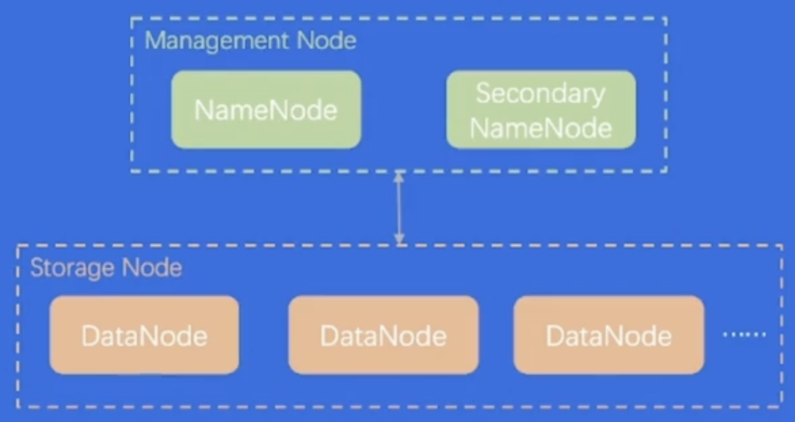
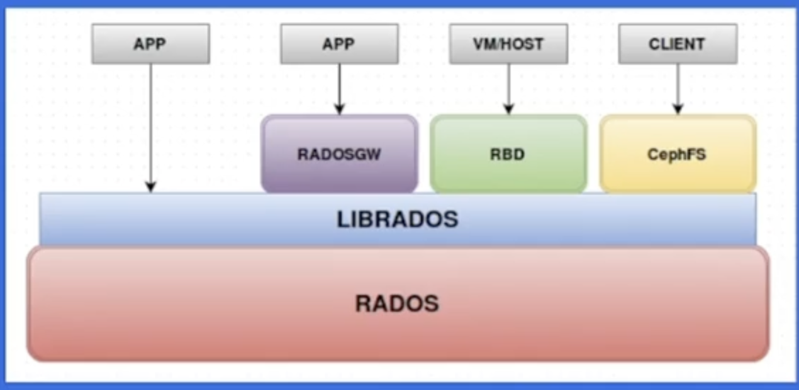
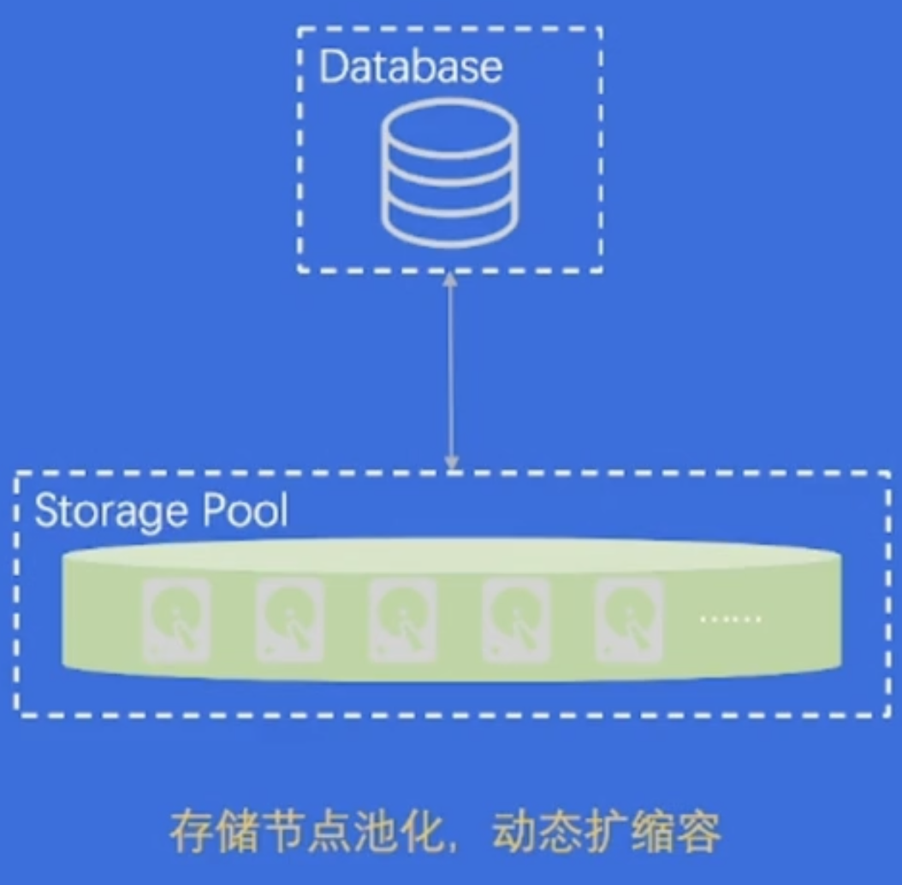

```json
{
    "date":"2023.02.11 22:30",
    "author":"XinceChan",
    "tags":["存储与数据库"],
    "musicId":"4330114"
}
```

存储系统和数据库系统往往是后端服务的最后一环，提供数据存储、查询能力。本课程会先用模拟案例导入，向学员介绍存储系统、数据库系统的特点，然后解析多个主流产品，最后分享存储和数据库结合新技术演进的方向。

## 存储 & 数据库简介

### 存储系统 - 概览

一个提供了读写、控制类接口，能够安全有效地把数据持久化的软件，就可以称为存储系统。

### 存储系统 - 特点

- 作为后端软件的底座，性能敏感

- 存储系统软件架构，容易受硬件影响
- 存储系统代码，既“简单”又“复杂”

### 存储系统 - RAID技术

Redundant Array of Inexpensive Disks

RAID出现的背景：

- 单块大容量磁盘的技术 > 多块小容量磁盘
- 单块磁盘的写入性能 < 多块磁盘的并发写入性能
- 单块磁盘的容错能力有限，不够安全

### 数据库 vs 经典存储

#### 结构化数据管理

- 写入关系型数据库，以表形式管理
- 写入文件，自行定义，管理结构

#### 事务能力

凸显出数据库支持「事务」的优越性

## 主流产品剖析

### 单机存储系统

单机存储 = 单个计算机节点上的存储软件系统，一般不涉及网络交互

- 本地存储系统
- key-value存储
  - 常见数据结构：LSM-Tree，某种程度上牺牲读性能，追求写入性能

### 分布式存储

分布式存储 = 在单机存储基础上实现了分布式协议，涉及大量网络交互

- 分布式文件系统

  - HDFS
    - 支持海量数据存储
    - 高容错性
    - 弱POSIX语义
    - 使用普通x86服务器，性价比高

  

- 分布式对象存储

  - Ceph

    - 一套系统支持对象接口、块接口、文件接口，但是一切皆对象

    - 数据写入采用主备复制模型

    - 数据分布模型采用CRUSH算法

  

### 单机数据库

单机数据库 = 单个计算机节点上的数据库系统

事务在单机内执行，也可能通过网络交互实现分布式事务

- 关系型数据库
- 非关系型数据库
  - MongoDB、Redis、Elasticsearch

#### Elasticsearch

- 面向「文档」存储
- 文档可序列化为JSON，支持嵌套
- 存在「Index」，index = 文档的集合
- 存储和构建索引能力依赖Lucene引擎
- 实现了大量搜索数据结构 & 算法
- 支持RESTFUL API，也支持弱SQL交互

#### MongoDB

- 面向「文档」存储
- 文档可序列化为JSON/BSON，支持嵌套
- 存在「Collection」，collection = 文档的集合
- 存储和构建索引能力依赖wiredTiger引擎
- 4.0后开始支持事务（多文档、跨分片多文档等）
- 常用client/SDK交互，可通过插件转移支持弱SQL

#### Redis

- 数据结构丰富
- C语言实现，超高性能
- 主要基于内存，但支持AOF/RDB持久化
- 常用redis-cli/多语言CDK交互

### 分布式数据库



## 