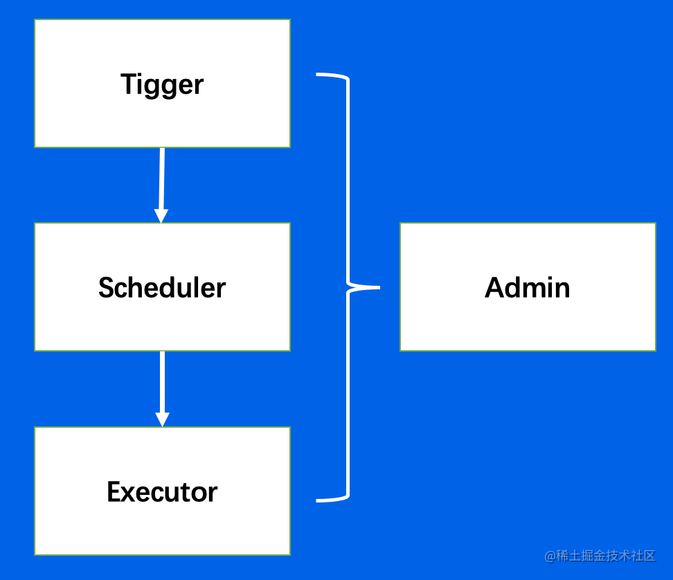

```json
{
    "date":"2023.02.08 14:40",
    "author":"XinceChan",
    "tags":["分布式理论","定时任务"],
    "musicId":"308299"
}
```

## 分布式定时任务

- 定义
  - 定时任务是指系统为了**自动**完成特定任务，**实时、延时、周期**性完成任务调度的过程。
  - 分布式定时任务是把分散的、可靠性差的定时任务纳入统一的**平台**，并实现集群管理调度和**分布式部署**的一种定时任务的管理方式。
- 按触发时机分类：
  - 定时任务：特定时间触发，比如今天 15:06 执行
  - 延时任务：延时触发，比如 10s 后执行
  - 周期任务：固定周期时间，或固定频率周期调度触发，比如每天 12 点或者每隔 5s 执行

- 特点
  - 自动化：全自动完成定时任务的调度和执行
  - 平台化：基于平台化的思维管控一系列的分布式定时任务
  - 分布式：在分布式系统环境下执行任务调度，突破单机定时任务的性能瓶颈
  - 伸缩性：采用集群方式部署，可以随时按需扩缩容
  - 高可用：单点故障不影响最终任务结果，可以做到故障转移

### 执行方式

- 单机任务：随机触发一台机器执行任务，适用于计算量小、并发度低的任务
- 广播任务：广播到所有机器上执行同一个任务，比如所有机器一起清理日志
- Map任务：一个任务可以分出多个子任务，每个子任务负责一部分的计算。适用于计算量大，单机无法满足要求的任务
- MapReduce任务：在Map任务的基础上，还可以对所有子任务的结果做汇总计算，适用于计算量大，并且需要对子任务结果做汇总的任务

## 实现原理

### 核心架构

分布式定时任务核心要解决**触发、调度、执行**三个关键问题

- 触发器：Trigger，解析任务，生成触发事件
- 调度器：Scheduler，分配任务，管理任务生命周期
- 执行器：Executor，获取执行任务单元，执行任务逻辑

除此之外，还需要提供一个控制台（Admin），提供任务管理和干预的功能。



**数据流**


**功能架构**


### 控制台

- **任务**：Job，任务元数据
- **任务实例**：JobInstance，任务运行的实例
- **任务结果**：JobResult，任务实例运行的结果
- **任务历史**：JobHistory，用户可以修改任务信息，任务实例对应的任务元数据可以不同，因而使用任务历史存储

#### 任务元数据

任务元数据（Job）是用户对任务属性定义，包括任务类型调度时机、执行行为等。

### 触发器

**核心职责：**给定一系列任务，解析它们的触发规则，在规定的时间点触发任务的调度

**设计约束：**

- 需支持大量任务
- 需支持秒级的调度
- 周期任务需要多次执行
- 需保证秒级扫描的高性能，并避免资源浪费

### 调度器

#### 资源来源

- 业务系统提供机器资源
- 定时任务平台提供机器资源


