```json
{
    "date":"2023.02.09 13:00",
    "author":"XinceChan",
    "tags":["消息队列"],
    "musicId":"308299"
}
```

消息队列（MQ），指保存消息的一个容器，本质是一个队列。需要支持高吞吐，高并发，并且高可用。

Kafka：分布式的、分区的、多副本的日志提交服务，在高吞吐场景下发挥较为出色

RocketMQ：低延迟、强一致、高性能、高可靠、万亿级容量和灵活的可扩展性，在一些实时场景中运用较广

Pulsar：是下一代云原生分布式消息流平台，集消息、存储、轻量化函数式计算为一体、采用存算分离的架构设计

BMQ：和Pulsar架构类似，存算分离，初期定位是承接高吞吐的离线业务场景，逐步替换掉对应的Kafka集群

## Kafka

### 使用场景

业务日志信息、用户行为数据、Metrics数据

### 使用Kafka

`创建集群` -> `新增topic` -> `编写生产者逻辑` -> `编写消费者逻辑`

### 基本概念

- `Topic`：逻辑队列，不同 Topic 可以建立不同的 Topic
- `Partition`：Topic 的不同分区，不同分区的消息可以并发处理
- `Cluster`：物理集群，每个集群中可以建立多个不同的 Topic
- `Producer`：生产者，负责将业务消息发送到 Topic 中
- `Consumer`：消费者，负责消费 Topic 中的消息
- `ConsumerGroup`：消费者组，不同组 Consumer 消息进度互不干涉

Offset：消息在partition内的相对位置信息，可以理解为唯一ID，在partition内部严格递增

每个分片有多个Replica，`Leader Replica`将会从`ISR`中选出

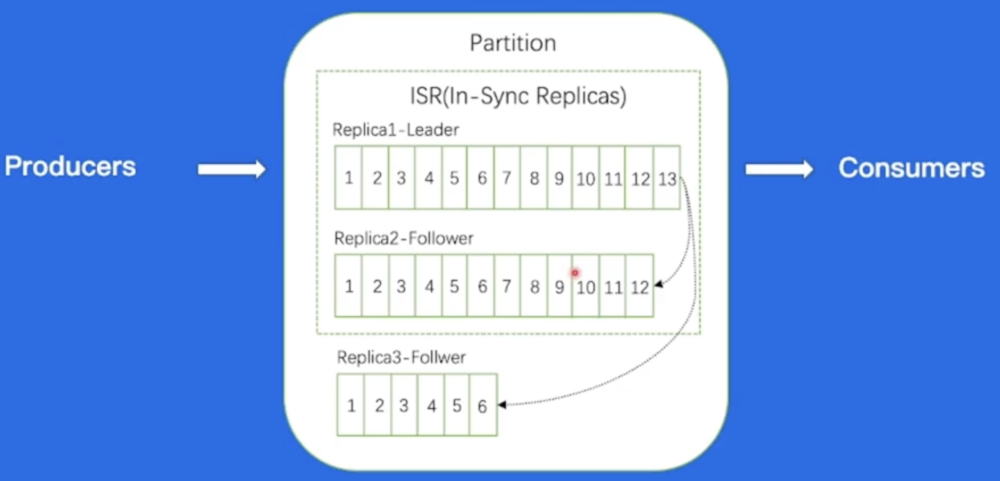

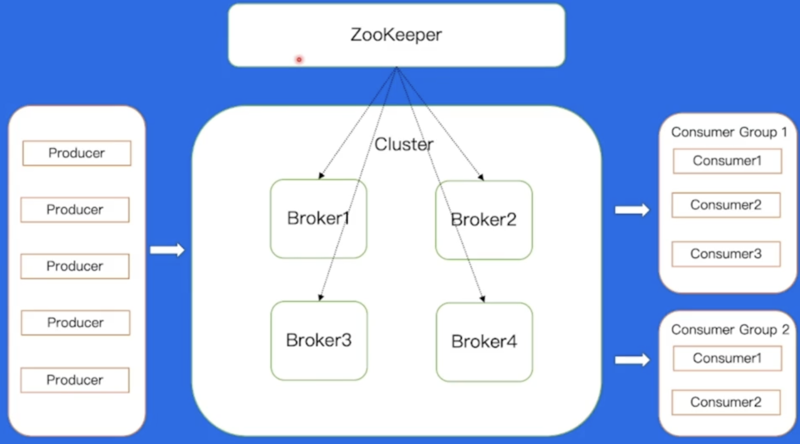

### Broker消息文件结构

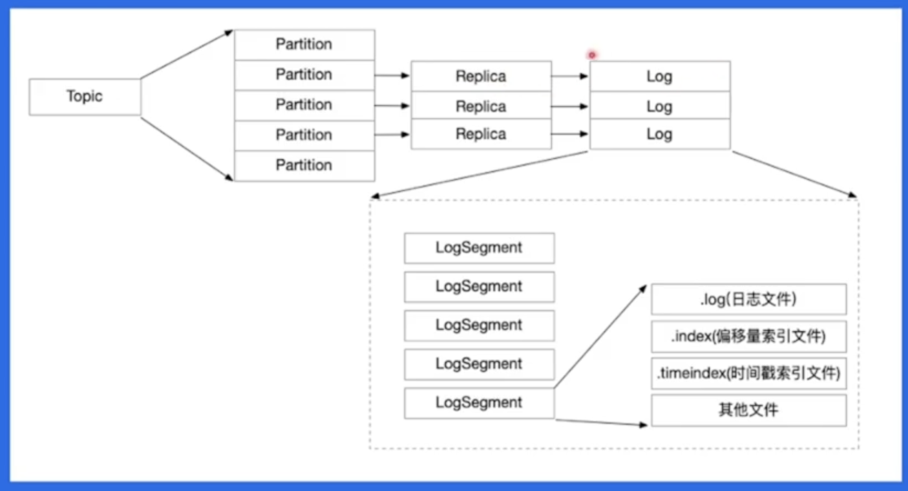

Broker 采用顺序写的方式进行写入，以提高写入效率

#### Broker如何找到消息

Consumer 通过发送 FetchRequest 请求消息数据，Broker 会将指定 offset 处的消息，按照时间窗口和消息大小窗口发送给 Consumer。

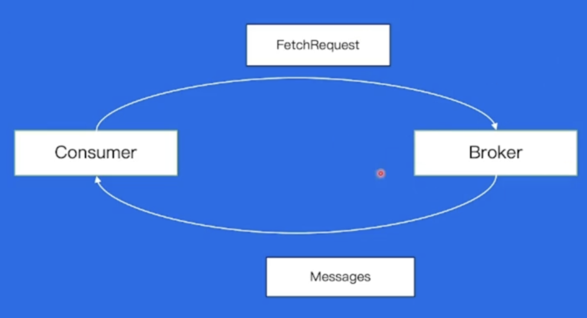

#### Broker偏移量索引文件

二分找到小于目标 Offset 的最大文件

#### Consumer-消息端的接收

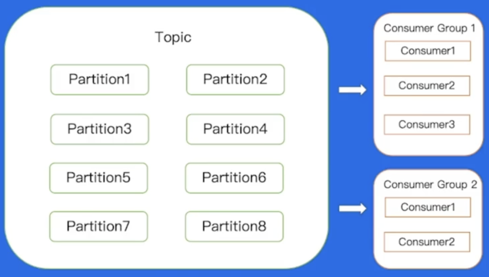

## BMQ

兼容 Kafka 协议，存算分离，云原生消息队列

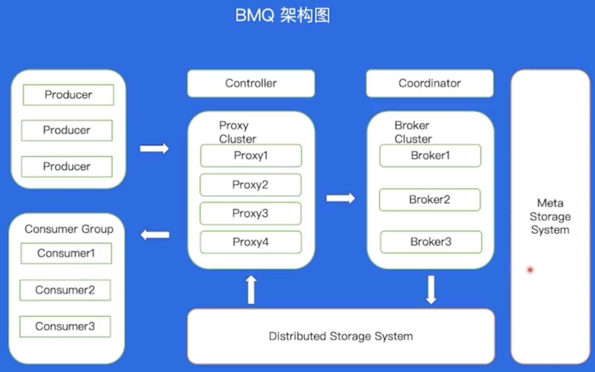

### 运维操作对比

| 具体操作 | Kafka                                |              BMQ               |
| :------- | ------------------------------------ | :----------------------------: |
| 重启     | 需要数据复制，分钟级重启             | 重启后可直接对外服务，秒级完成 |
| 替换     | 需要数据复制，分钟级替换，甚至天级别 | 替换后可直接对外服务，秒级完成 |
| 扩容     | 需要数据复制，分钟级扩容，甚至天级别 | 扩容后可直接对外服务，秒级完成 |
| 缩容     | 需要数据复制，分钟级缩容，甚至天级别 | 缩容后可直接对外服务，秒级完成 |

### HDFS写文件流程

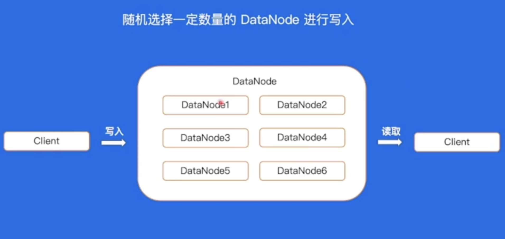

### Broker-Partition 状态机

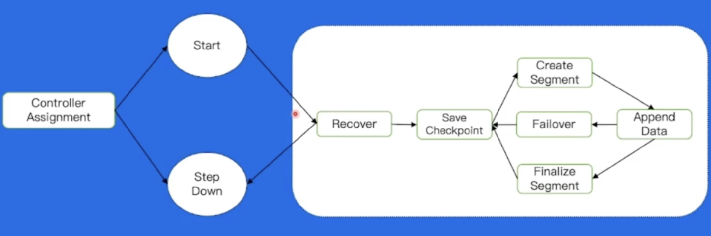

### Broker 写文件流程

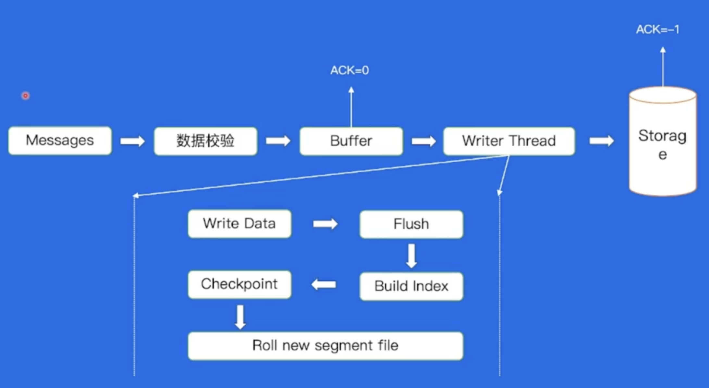

### Broker-写文件Failover

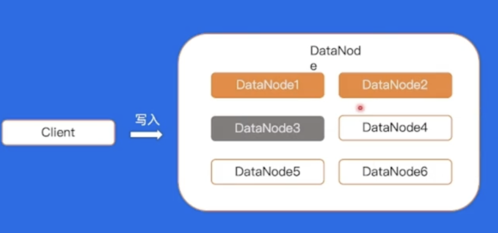

### BMQ高级特性

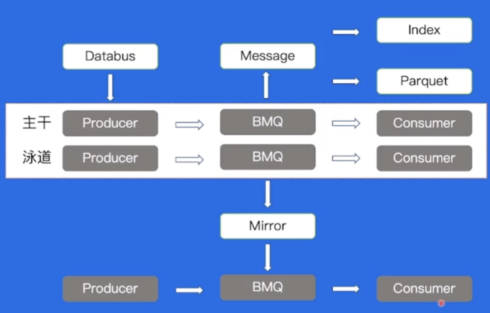

### 泳道消息

BOE：Bytedance Office Environment，是一套完全独立的线下机房环境

PPE：Product Preview Environment，产品预览环境


### Databus

1. 简化消息队列客户端复杂度
2. 解耦业务与 Topic
3. 缓解集群压力，提高吞吐

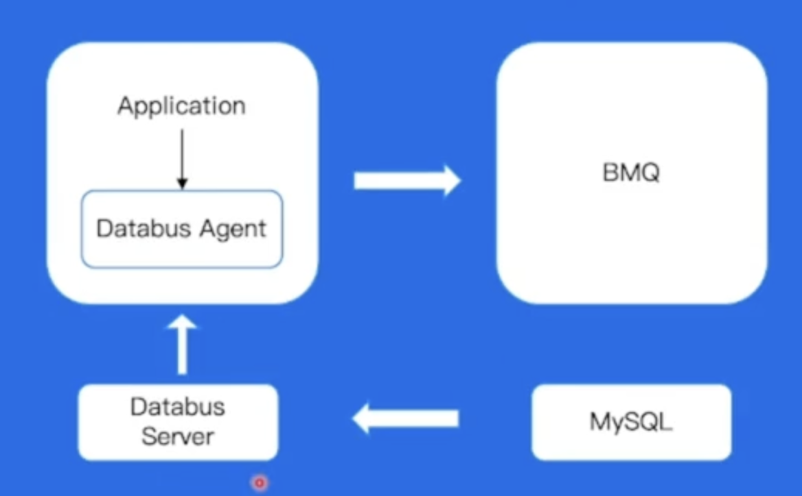

### Mirror

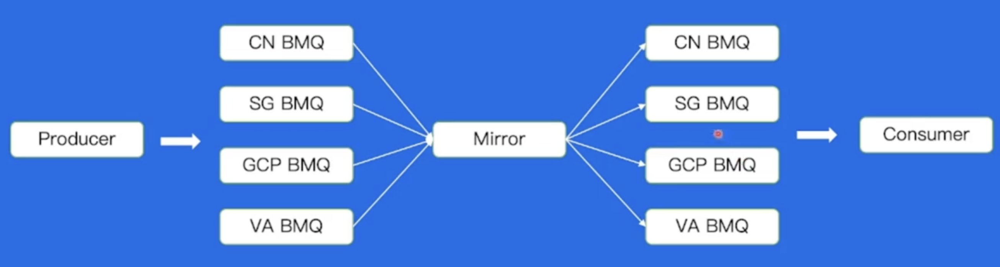

### Index

直接在BMQ中将数据结构化，配置索引DDL，异步构建索引后，通过Index Query服务读出数据

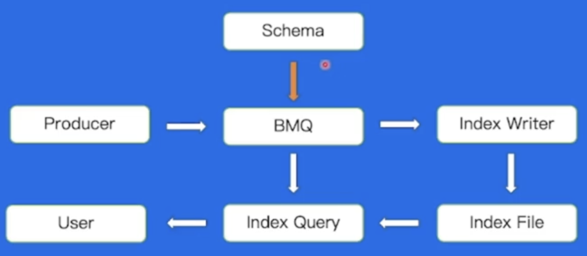

### Parquet

Apache Parquet是Hadoop生态圈一种`新型列式存储格式`，它可以兼容Hadoop生态圈中大多数计算框架（Hadoop、Spark等），被多种查询引擎支持（Hive、Impala、Drill等）。

## RocketMQ

### 基础概念

|    名称    |     Kafka      |    RocketMQ    |
| :--------: | :------------: | :------------: |
|  逻辑队列  |     Topic      |     Topic      |
|   消息体   |    Message     |    Message     |
|    标签    |       无       |      Tag       |
|    分区    |   Partition    | ConsumerQueue  |
|   生产者   |    Producer    |    Producer    |
| 生产者集群 |       无       | Producer Group |
|   消费者   |    Consumer    |    Consumer    |
| 消费者集群 | Consumer Group | Consumer Group |
| 集群控制器 |   Controller   |   Nameserver   |

### 架构

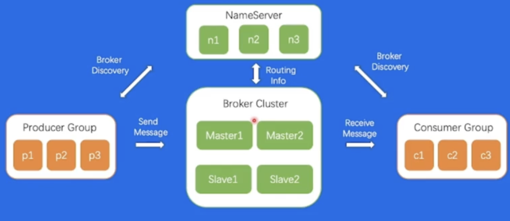

### 存储模型

密集索引

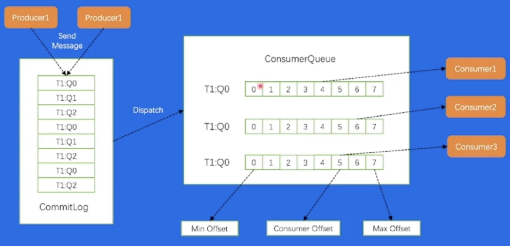
