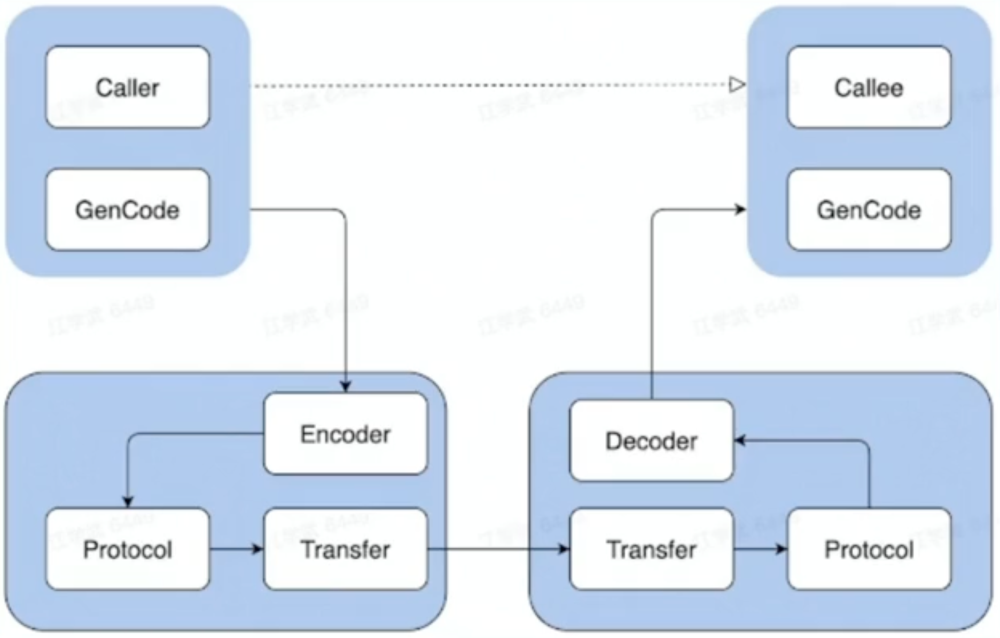
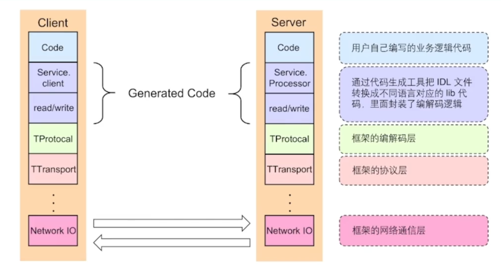
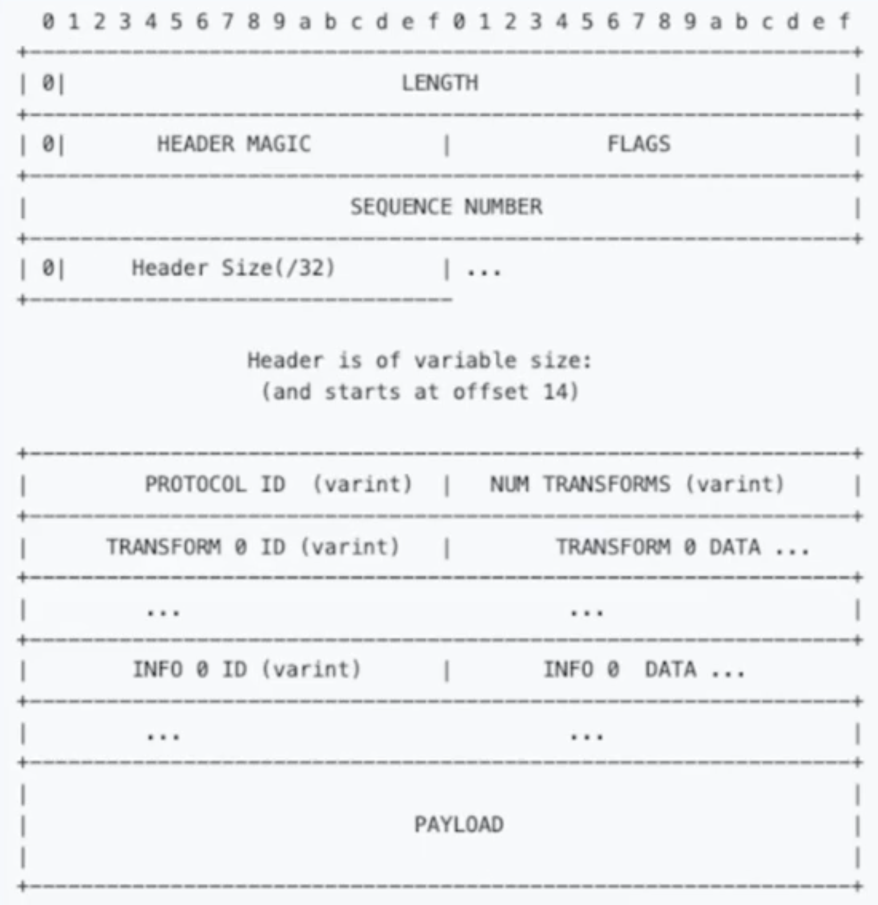
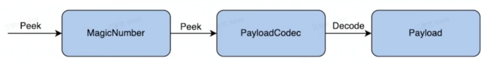
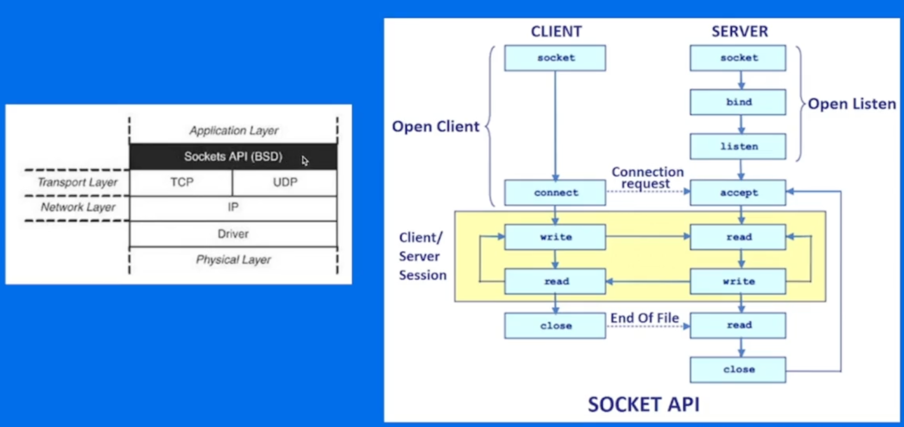
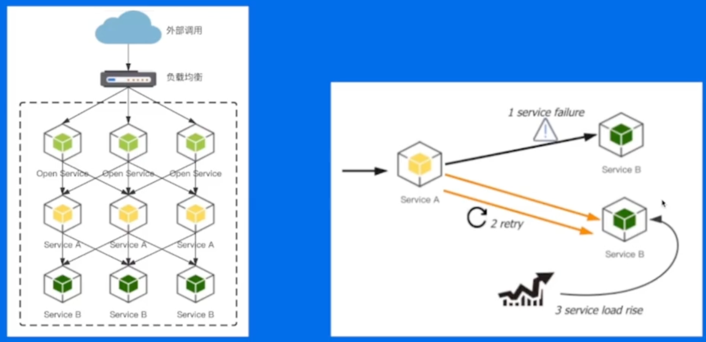
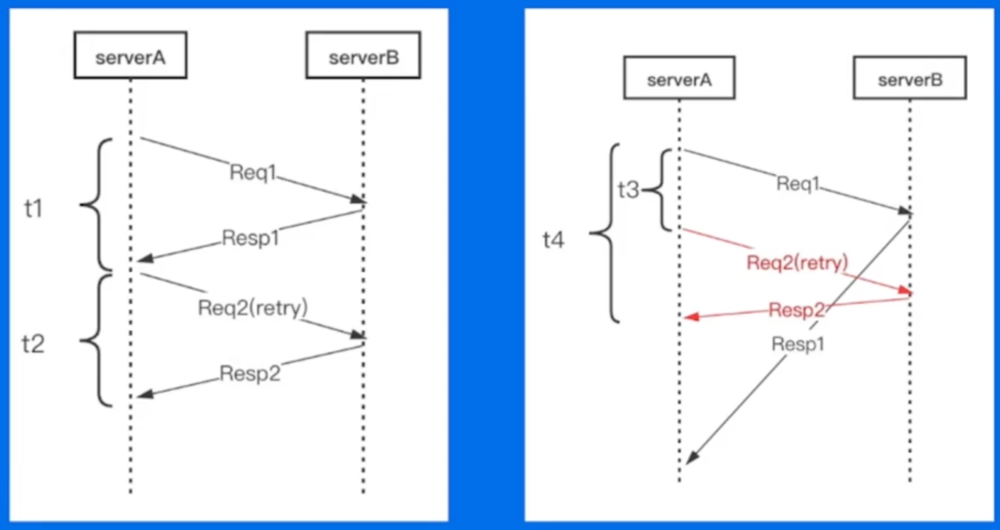

```json
{
    "date":"2023.02.10 16:50",
    "author":"XinceChan",
    "tags":["RPC框架","微服务治理"],
    "musicId":"1386012293"
}
```

## 基础概念

### 本地函数调用

```go
func main() {
    var a = 2
    var b = 3
    result := calculate(a, b)
    fmt.Println(result)
    return
}
func calculate(x, y int) int {
    z := x * y
    return z
}
```

### 远程函数调用（RPC - Remote Procedure Calls）

RPC需要解决的问题

- 函数映射
- 数据转换成字节流
- 网络传输

### 一次RPC的完整过程

- IDL（Interface description language）文件
  - IDL通过一种中立的方式来描述接口，使得在不同平台上运行的对象和用不同语言编写的程序可以相互通信
- 生成代码
  - 通过编译器工具把IDL文件转换成语言对应的静态库
- 编解码
  - 从内存中表示到字节序列的转换称为编码，反之为解码，也常叫做序列化和反序列化
- 通信协议
  - 规范了数据在网络中的传输内容和格式。除必须的请求/响应数据外，通常还会包括额外的元数据
- 网络传输
  - 通常基于成熟的网络库走 TCP/UDP 传输



### RPC的好处

- 单一职责，有利于分工协作和运维开发
- 可扩展性强，资源利用率更优
- 故障隔离，服务的整体可靠性更高

## 分层设计



Client和Server依赖同一份IDL文件来生成不同的代码

### 编解码层 - 数据格式

- 语言特定的格式
  - 许多编程语言都内建了将内存对象编码为字节序列的支持，例如 Java 有 java.io.Serializable
- 文本格式
  - JSON、XML、CSV等文本格式，具有人类可读性
- 二进制编码
  - 具备跨语言和高性能等优点，常见有Thrift的BinaryProtocol，Protobuf等

#### 二进制编码

**TLV编码**

- Tag：标签，可以理解为类型
- Length：长度
- Value：值，Value也可以是个TLV结构

#### 选型

- 兼容性
  - 支持自动增加新的字段，而不影响老的服务，这将提高系统的灵活度
- 通用性
  - 支持跨平台、跨语言
- 性能
  - 从空间和时间两个维度来考虑，也就是编码后数据大小和编码耗费时长

### 协议层

#### 概念

- 特殊结束符

  - 一个特殊字符作为每个协议单元结束的标示

  | message body | \r\n | message body | \r\n |
  | :----------: | :--: | :----------: | :--: |

- 变长协议

  - 以定长加不定长的部分组成，其中定长的部分需要描述不定长的内容长度

  | length | message body | length | message body |
  | :----: | :----------: | :----: | :----------: |

#### 协议构造

- Length：数据包大小，不包含自身
- HEADER MAGIC：标识版本信息，协议解析时候快速校验
- SEQUENCE NUMBER：表示数据包的seqID，可用于多路复用，单连接内递增
- HEADER SIZE：头部长度，从第14个字节开始计算一直到PAYLOAD前
- PROTOCOL ID：编解码方式，有Binary和Compact两种
- TRANSFORM ID：压缩方式，如zlib和snappy
- INFO ID：传递一些定制的meta信息
- PAYLOAD：消息体



### 协议解析



### 网络通信层 - Sockets API



### 网络库

- 提供易用API
  - 封装底层Socket API
  - 连接管理和事件分发
- 功能
  - 协议支持：tcp、udp和uds等
  - 优雅退出、异常处理等
- 性能
  - 应用层buffer减少copy
  - 高性能定时器、对象池等

## 关键指标

### 稳定性 - 保障策略

- 熔断：保护调用方，防止被调用的服务出现问题而影响到整个链路
- 限流：保护被调用方，防止大流量把服务压垮
- 超时控制：避免浪费资源在不可用节点上

### 稳定性 - 请求成功率



### 稳定性 - 长尾请求



### 稳定性 - 注册中间件

- WithTimeout（）
- WithRateLimiter（）
- WithLoadbalancer
- WithRetry

### 易用性

- 开箱即用
  - 合理的默认参数选项、丰富的文档
- 周边工具
  - 生成代码工具、脚手架工具

### 扩展性

- Middleware

- Option
- 编解码层
- 协议层
- 网络传输层
- 代码生成工具插件扩展

### 高性能

- 场景
  - 单机多机
  - 单连接多连接
  - 单/多Client 单/多Server
  - 不同大小的请求包
  - 不同请求类型：例如pingpong、streaming等
- 目标
  - 高吞吐
  - 低延迟
- 手段
  - 连接池
  - 多路复用
  - 高性能编解码协议
  - 高性能网络库

